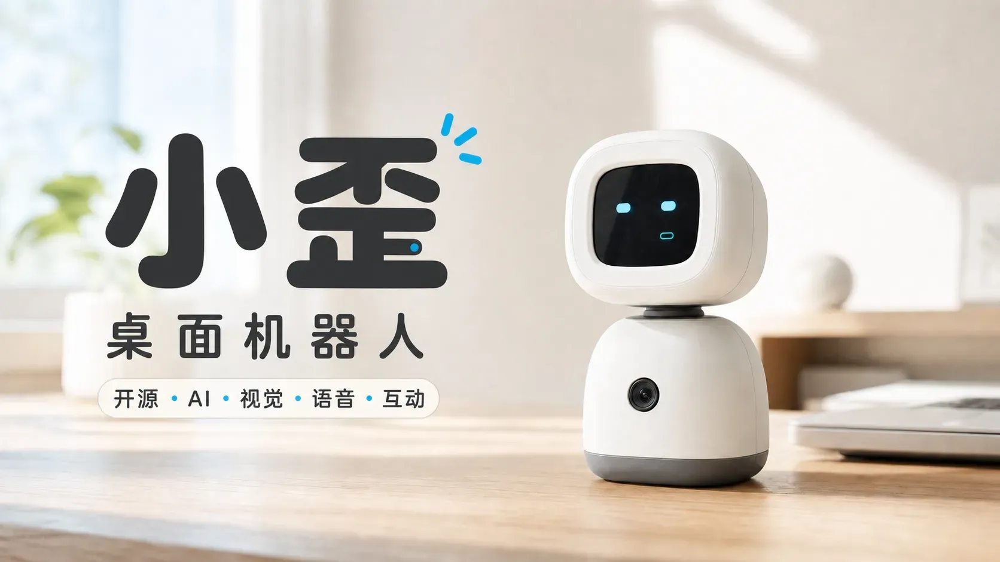
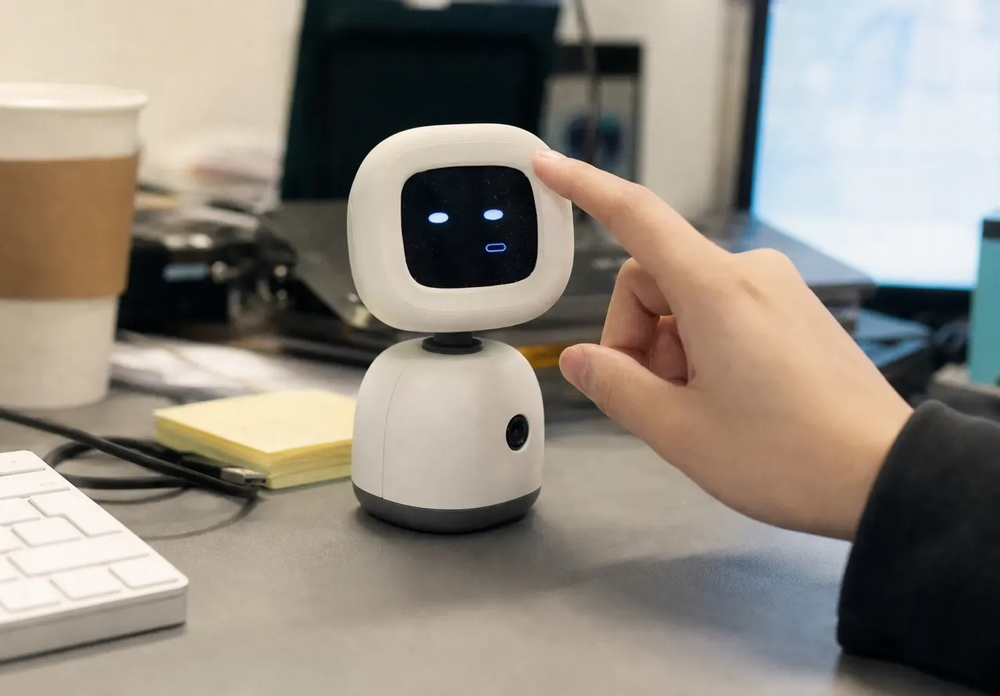

<h1 align="center">OpenDeskBotV2</h1>

<p align="center">
  桌面 AI 机器人「小歪」 · 开源固件、PC 端服务与一键安装的桌面客户端
</p>

<p align="center">
  听见 → 听懂 → 回应 → 表情与动作 → 主动陪伴
</p>

<p align="center">
  
  
  
  
  
</p>

## 一台插上就能聊天的桌面机器人

**不连云、不配服务器：装好客户端，插上 USB，就能对话。**

OpenDeskBotV2 是一台开源的 ESP32-S3 桌面机器人。它能听你说话、用大模型思考、开口回应，配合表情和头部动作做出反馈，还会在你冷场的时候主动找话说。机器人不连接任何云服务器——所有对外请求都由你自己的电脑发出，用的是你自己的模型 API Key，数据流向完全由你掌控；可选的 Wi-Fi 链路也只在局域网内回连你的电脑。

**立即开始：** [下载客户端](https://github.com/tudoom/OpenDeskBotV2/releases) · [快速开始](#快速开始) · [硬件资料](https://oshwhub.com/eda_hedwaytj/project_asxqsedb) · [反馈问题](https://github.com/tudoom/OpenDeskBotV2/issues)

<p align="center">
  
  
</p>

## 最新更新

**v0.9**（2026-09-16） · [下载与完整说明](https://github.com/tudoom/OpenDeskBotV2/releases/tag/v0.9) · [全部版本](https://github.com/tudoom/OpenDeskBotV2/releases)

修复了一些 bug。

## V2 相比 V1 的变化

**设备端**

- 适配了新的 PCB，固件持续迭代到 0.0.59：USB 链路稳定性、舵机运动保护、片内温度保护、Wi-Fi 备用链路、设备端麦克风策略。

**PC 端**

1. 提供 Windows 与 macOS 的一键安装桌面客户端：打开客户端即自动拉起全部本机服务并打开控制台，不需要配置任何服务器端点或账号，也不需要手动启动任何服务；
2. 只需填入大模型和语音的 API Key，插上设备即可使用；
3. 控制台从调试台长成完整产品：Agent 对话、卡通表情、表演编排、主动陪伴、家居控制、固件更新都在客户端里完成。

## 功能

| 能力 | 说明 |
|---|---|
| 语音对话 | 设备端 ESP-SR 完成 AEC / 降噪 / VAD，PC 端走 ASR → 大模型 → TTS；支持说话中打断；设备端可按需上行、可一键静音 |
| 主动陪伴 | 为小歪设计陪伴场景：小目标按顺序推进、冷场时主动开口、日常关心可定时；也可用一句话让 AI 生成整套场景 |
| Agent 对话 | 与小歪文字对话；`Agent.md` 人设、`User.md` 主人档案、`Memory.md` 记忆均可查看与编辑；支持联网搜索与家居控制 |
| 表情 | 矢量表情之外，可用 AI 生成任意风格的卡通位图表情，一键生成待机 / 倾听 / 思考 / 说话整套并应用到设备 |
| 表演 | 用自然语言生成「表情 + 动作 + 语音」的交互表演组合，内置五段表演，可在控制台直接运行 |
| 头部动作 | 双轴舵机：AI 生成动作、3D 模拟预览、舵机限位与视角配置；空闲时自然张望 |
| 摄像头 | 拍照与画面理解，图像不落盘 |
| 大模型可选 | OpenAI 兼容接口；控制台内置 DeepSeek（默认）/ 豆包（火山方舟）/ MiMo 预设，也可自定义接入点 |
| 家居控制 | 绑定米家账号后可用语音或 Agent 对话控制智能设备与场景，基于小米开源的 Miloco SDK（`miloco-miot`） |
| 声音 | 豆包语音合成，内置音色库；上传一段音频即可复刻专属音色 |
| 设备连接 | USB 直连；一键配网后机器人可经局域网 Wi-Fi 回连电脑，USB 始终优先 |
| 固件更新 | 客户端随包附带匹配版本的固件，控制台「固件」页一键通过 USB 烧录 |

## 快速开始

只需要桌面客户端，不用自己配环境、也不用启动任何服务。

1. **下载安装包**：从 [Releases](https://github.com/tudoom/OpenDeskBotV2/releases) 下载 Windows 的 `OpenDeskBotV2-<版本>-Setup.exe`（Windows 10 / 11 x64）或 macOS 的 `OpenDeskBotV2-<版本>.dmg`（Apple Silicon），并核对 Release 页给出的 SHA-256。
2. **安装**：Windows 双击安装即可，安装过程自动完成运行时准备，**无需管理员权限、不弹防火墙授权窗口**；macOS 打开 DMG，把 `OpenDeskBotV2.app` 拖进「应用程序」，首次打开请在图标上右键选「打开」（应用未经 Apple 公证）。
3. **打开客户端**：客户端自动启动本机服务并打开控制台窗口；首次启动会直接进入「模型配置」页。
4. **填入 Key**：在「模型配置」填通用大模型的 API Key（默认 DeepSeek）和豆包语音（ASR / TTS）的 Key。
5. **插上机器人**：用 USB 线把机器人接到电脑，控制台首页显示设备在线后即可开口对话。想改用 Wi-Fi，到「设备连接」页一键配网。
6. **烧录 / 更新固件**（按需）：设备出厂已烧录固件；升级用控制台一键完成，新板子或空片的首次烧录按下面「烧录固件」的方式二操作。

### 烧录固件

**方式一：客户端一键升级（已有固件的机器）。** 用 USB 线接上正在运行固件的机器人，打开控制台「固件」页：页面会显示设备当前版本和客户端随包的固件版本，点「烧录」即可，全程不需要安装任何开发工具。它只重写应用分区，**不能用于新板子或空片的首次烧录**，首次烧录请用方式二。

**方式二：用 Release 里的固件包全量烧录（新板子 / 空片 / 恢复）。** 从 [Releases](https://github.com/tudoom/OpenDeskBotV2/releases) 下载 `OpenDeskBotV2-firmware-<版本>.zip`（内含 bootloader / partitions / boot_app0 / firmware 四个 bin 和烧录说明），用 [esptool](https://github.com/espressif/esptool)（`pip install esptool`）全量烧录：

```bash
esptool.py --chip esp32s3 --port <串口> erase_flash
esptool.py --chip esp32s3 --port <串口> write_flash 0x0 bootloader.bin 0x8000 partitions.bin 0xe000 boot_app0.bin 0x10000 firmware.bin
```

只想更新应用、保留设备端设置时，只刷 `0x10000 firmware.bin` 即可。

**方式三：自己编译。** 安装 [PlatformIO](https://platformio.org/) 后执行：

```bash
cd hardware
pio run -e deskbot_v2 -t upload
```

手动烧录前先退出桌面客户端，释放被它占用的串口；设备曾运行更早的固件时，第一次刷本版本前建议整片擦除，避免旧的设备端设置残留。烧录完成后机器人屏幕会显示「请连接PC服务」的待机画面，打开客户端连上即可。更多细节见 [hardware/README.md](hardware/README.md)。

## 获取 API Key

| 用途 | 入口 |
|---|---|
| 通用大模型（默认 DeepSeek） | [DeepSeek 开放平台](https://platform.deepseek.com/api_keys) |
| 通用大模型（可选豆包） | [火山方舟](https://console.volcengine.com/ark/model) |
| 通用大模型（可选 MiMo） | [MiMo 大模型](https://mimo.mi.com/docs/zh-CN/quick-start/summary/welcome) |
| 语音识别 / 语音合成 / 声音复刻 | [豆包语音](https://console.volcengine.com/speech) |
| 联网检索（可选） | 火山方舟 API Key；大模型本身就是豆包时自动复用，不用另填 |
| 家居控制（可选） | 控制台「米家」页用米家账号授权，不需要填 Key |

Key 只保存在你自己电脑的本地配置里，不会随安装包分发，也不会上传到任何第三方。

## 控制台一览

| 页面 | 用途 |
|---|---|
| 首页 | 设备状态、摄像头实时画面、最近对话与 Agent 日志 |
| 表情 | 矢量表情编辑，AI 生成卡通表情套图，设为默认 |
| 声音 | 选择音色、声音复刻 |
| 动作 | 舵机限位与视角、直接下发动作、AI 生成动作、3D 模拟 |
| 表演 | 编排与运行「表情 + 动作 + 语音」组合，AI 一句话生成表演 |
| 米家 | 米家账号授权与设备列表 |
| Agent 对话 | 文字对话，查看与编辑人设、主人档案和记忆 |
| 主动陪伴 | 陪伴场景与小目标、日常关心定时、空闲张望与打盹开关 |
| 设备连接 | USB / Wi-Fi 连接状态，一键配网 |
| 模型配置 | 大模型、语音、联网检索、生图 API 的 Key 与接入点 |
| 参数设置 | 静音开关、麦克风上行模式、温度断电阈值 |
| 固件 | 设备固件版本、随包固件一键烧录 |

## 系统架构

机器人默认通过 USB 与本机服务通信；一键配网后也可经局域网 TCP 回连同一台电脑（USB 始终优先）。固件不访问互联网，联网、供应商 API 调用、资源下载和时间同步全部由 PC 负责。

```text
统一固件机器人（device_id = "deskbot_" + eFuse base MAC）
          │
          │ USB CDC / DBOT v1 协议 ─── 或 ─── 局域网 TCP（配网后，USB 优先）
          ▼
桌面客户端（Windows / macOS）
  ├─ 核心服务 :9000（唯一持有串口的进程）
  │    ├─ USB / Wi-Fi 自动发现、握手、心跳、重连
  │    ├─ LiveKit 实时音频桥、语音 Agent、工具桥、视觉 / PB 时间线
  │    └─ 主动陪伴、提醒、记忆整理等后台循环
  └─ Web 控制台 :5050（不打开串口，经本机进程间凭证访问核心服务）
```

所有服务只绑定 `127.0.0.1`，不对局域网暴露；Wi-Fi 链路只接受机器人回连。

## 固件

所有机器人烧录同一份固件镜像，设备码由芯片 eFuse MAC 生成，镜像里不含任何凭证或每台设备的配置。日常更新用控制台「固件」页一键完成；需要自行编译或手动烧录时，请看 [hardware/README.md](hardware/README.md)。

## 目录结构

| 目录 | 内容 |
|---|---|
| [`hardware/firmware/`](hardware/firmware/) | ESP32-S3 固件源码（PlatformIO） |
| [`hardware/docs/`](hardware/docs/) | 固件内存预算等设备端文档 |
| [`service/`](service/) | PC 端核心服务与 Web 控制台 |
| [`service/client/`](service/client/) | Windows 桌面客户端与安装包构建 |
| [`service/client-macos/`](service/client-macos/) | macOS 桌面客户端与 DMG 构建 |
| [`service/docs/`](service/docs/) | 架构、协议与接口文档 |

## 文档

| 你要找什么 | 入口 |
|---|---|
| 安装包与固件下载 | [GitHub Releases](https://github.com/tudoom/OpenDeskBotV2/releases) |
| 固件说明、编译与烧录 | [hardware/README.md](hardware/README.md) |
| Windows 客户端 | [service/client/README.md](service/client/README.md) |
| macOS 客户端 | [service/client-macos/README.md](service/client-macos/README.md) |
| PC 端服务与二次开发 | [service/README.md](service/README.md) |
| 系统架构 | [service/docs/ARCHITECTURE.md](service/docs/ARCHITECTURE.md) · [完整架构说明](service/docs/CURRENT_PROJECT_ARCHITECTURE.md) |
| 设备通信协议 | [service/docs/esp32_pb_protocol.md](service/docs/esp32_pb_protocol.md) |
| HTTP / WS 接口 | [service/docs/api_interfaces.md](service/docs/api_interfaces.md) |
| 舵机动作架构 | [service/docs/SERVO_ACTION_ARCHITECTURE.md](service/docs/SERVO_ACTION_ARCHITECTURE.md) |
| 原理图、PCB、BOM 与复刻资料 | [嘉立创开源硬件平台](https://oshwhub.com/eda_hedwaytj/project_asxqsedb) |

## 隐私说明

- 机器人不访问任何云服务器；即使配置了 Wi-Fi，也只在局域网内连接你的电脑，所有对外请求由你的电脑发出；
- 对外流量仅限你自己配置的模型供应商，不含任何遥测、埋点或崩溃上报；
- 摄像头画面不落盘，日志默认对语音转写和模型回复做脱敏；
- API Key 只存在本机配置文件中，安装包默认不携带任何凭证。

## 参与贡献

欢迎提交 Issue 和 Pull Request。提交前请阅读 [CONTRIBUTING](service/CONTRIBUTING.md) 与 [行为准则](hardware/CODE_OF_CONDUCT.md)。

请勿在 Issue 中提交 API Key、录音或设备标识。安全问题请按 [SECURITY](service/SECURITY.md) 中的方式私下反馈，不要公开提交。

## 联系我们

- **邮箱：** `avalon.ty@gmail.com`
- **微信号：** `avalon_ty`
- **问题反馈与功能建议：** [GitHub Issues](https://github.com/tudoom/OpenDeskBotV2/issues)

<p align="center">
  <strong>微信交流群</strong>
  <br>
  使用微信扫描下方二维码加入
  <br><br>
  
</p>

## 致谢

本项目建立在这些工作之上：

- **[Xiaomi Miloco](https://github.com/XiaoMi/xiaomi-miloco)** —— 家居控制能力由其开源 SDK `miloco-miot` 提供，负责米家账号授权、设备发现与属性读写。安装包内分发的该组件版权归小米所有，依 [Xiaomi Miloco License](https://github.com/XiaoMi/xiaomi-miloco/blob/main/LICENSE.md) 授权，仅限非商业用途使用，其版权标识与免责声明随该组件一并保留。
- **[LiveKit](https://github.com/livekit/livekit)** —— 本机 SFU 与实时音频管线。
- **[Silero VAD](https://github.com/snakers4/silero-vad)** —— PC 端语音活动检测模型。
- **[火山引擎豆包语音](https://www.volcengine.com/product/voice-tech)** —— 语音识别、语音合成与声音复刻。
- **[ESP-SR](https://github.com/espressif/esp-sr)**（乐鑫）—— 设备端回声消除、降噪与语音活动检测。
- **[PlatformIO](https://platformio.org/)** 与 **[Arduino-ESP32](https://github.com/espressif/arduino-esp32)** —— 固件构建与运行时。

其余第三方依赖适用其各自的许可证，详见各依赖自带的许可证文件。

## License

- **Hardware**（结构、PCB、原理图与 BOM，托管于[嘉立创开源硬件平台](https://oshwhub.com/eda_hedwaytj/project_asxqsedb)）：CERN-OHL-S-2.0
- **Firmware** (`hardware/firmware/`)：[GPL-3.0](hardware/firmware/LICENSE)
- **Service** (`service/`)：[GPL-3.0](service/LICENSE)

各部分依赖的第三方组件适用其各自的许可证，详见[致谢](#致谢)。其中安装包内
分发的 `miloco-miot` 依 Xiaomi Miloco License 授权，仅限非商业用途。

Copyright © 2026 OpenDeskBot Contributors
