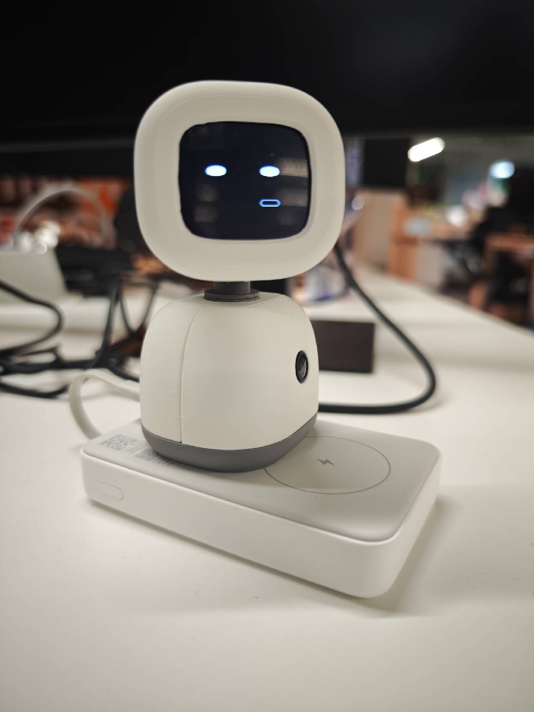

<h1 align="center">OpenDeskBotV2</h1>

<p align="center">
  桌面 AI 机器人 · 开源固件、PC 服务与一键安装客户端
</p>

<p align="center">
  听见 → 听懂 → 回应 → 表情与动作
</p>

<p align="center">
  
  
  
  
  
</p>

## 一台插上就能聊天的桌面机器人

**不连云、不配服务器，插上 USB 就能对话。**

OpenDeskBotV2 是一台开源的 ESP32-S3 桌面机器人。它能听你说话、用大模型思考、开口回应，并配合表情和头部动作做出反馈。机器人本身不联网、不连接任何云服务器——所有对外请求都由你自己的电脑发出，用的是你自己的模型 API Key，数据流向完全由你掌控。

**立即开始：** [下载客户端](https://github.com/tudoom/OpenDeskBotV2/releases) · [快速开始](#快速开始) · [硬件资料](https://oshwhub.com/eda_hedwaytj/project_asxqsedb) · [反馈问题](https://github.com/tudoom/OpenDeskBotV2/issues)

<p align="center">
  
</p>

## V2 相比 V1 的变化

V2 版在 V1 的基础上对设备端固件和 PC 端都进行了全面优化。

**设备端**

- 适配了新的 PCB。

**PC 端**

1. 大幅简化了安装和调试的难度，无需配置任何服务器端点以及账号，只需要启动服务 → 连接设备（已烧录好固件）→ 配置好大模型和 ASR（TTS）的 key，就可以直接使用；
2. 提供了独立的 EXE 客户端，便于不想自己启动服务的同学一键安装，安装后直接插上设备即可使用，简化使用流程。

## 功能

| 能力 | 说明 |
|---|---|
| 语音对话 | 设备端 ESP-SR 完成 AEC / 降噪 / VAD，PC 端走 ASR → 大模型 → TTS，支持说话中打断 |
| 表情显示 | 屏幕显示情绪表情，未连接 PC 时展示待机画面 |
| 头部动作 | 双轴舵机，支持点头、摇头、左右看等动作，可在控制台自定义编排 |
| 摄像头 | 拍照与画面理解，图像不落盘 |
| 大模型可选 | OpenAI 兼容接口接入，控制台内置 DeepSeek / 豆包 / MiMo 预设，也可自定义 |
| Web 控制台 | 设备管理、供应商配置、动作编排与调试实验台 |

## 快速开始

### 方式一：EXE 客户端（推荐）

适合不想自己配环境的用户。

1. 从 [Releases](https://github.com/tudoom/OpenDeskBotV2/releases) 下载 `OpenDeskBotV2-Setup.exe` 并核对 SHA-256；
2. 运行安装，安装过程中自动完成运行时准备，**无需管理员权限、不弹防火墙授权窗口**；
3. 插上已烧录固件的设备；
4. 打开客户端，在控制台里填入大模型和 ASR / TTS 的 API Key，即可开始对话。

### 方式二：从源码启动服务

适合需要二次开发的用户。推荐 Ubuntu 22.04/24.04 或 macOS，Windows 可使用等价 Python 环境。需要 Python 3.11、Opus 和 ffmpeg。

```bash
cd service
cp .env.example .env
# 填入所选供应商的 ASR / LLM / TTS 凭证
chmod +x start.sh
./start.sh
```

启动后访问 Web 控制台 `http://127.0.0.1:5050/`。详见 [service/README.md](service/README.md)。

### 获取 API Key

**Key 获取示例**（也可以使用其它模型如 DeepSeek 等）：

- [豆包大模型](https://console.volcengine.com/ark/model)
- [豆包 ASR/TTS](https://console.volcengine.com/speech)
- [MiMo 大模型](https://mimo.mi.com/docs/zh-CN/quick-start/summary/welcome)

Key 只保存在你自己电脑的本地配置里，不会随安装包分发，也不会上传到任何第三方。

### 烧录固件

设备出厂已烧录固件。需要手动烧录或恢复时：

```bash
cd hardware
pio run -e deskbot_v2 -t upload
```

## 系统架构

机器人只通过 USB CDC 与本机 PC 服务通信，固件不建立任何独立网络连接。联网、供应商 API 调用、资源下载和时间同步全部由 PC 负责。

```text
统一固件机器人
  device_id = "deskbot_" + eFuse base MAC
          │
          │ USB CDC / DBOT v1 协议
          ▼
核心服务 :9000（唯一持有串口的进程）
  ├─ USB 自动发现、握手、心跳、重连
  ├─ LiveKit RTC 音频桥、工具桥、视觉 / PB 时间线
  └─ 浏览器调试订阅
          ▲
          │ X-API-Key（本机进程间凭证）
Web 控制台 :5050（不打开串口）
```

所有服务默认只绑定 `127.0.0.1`，不对局域网暴露。

## 目录结构

| 目录 | 内容 |
|---|---|
| [`hardware/firmware/`](hardware/firmware/) | ESP32-S3 固件源码（PlatformIO） |
| [`service/`](service/) | Python PC 服务与 Web 控制台 |
| [`service/client/`](service/client/) | Windows 桌面客户端与安装包构建 |
| [`service/docs/`](service/docs/) | 架构、协议与接口文档 |

## 文档

| 你要找什么 | 入口 |
|---|---|
| 安装包与固件下载 | [GitHub Releases](https://github.com/tudoom/OpenDeskBotV2/releases) |
| PC 服务安装与使用 | [service/README.md](service/README.md) |
| 固件说明与烧录 | [hardware/README.md](hardware/README.md) |
| Windows 客户端 | [service/client/README.md](service/client/README.md) |
| 系统架构 | [service/docs/ARCHITECTURE.md](service/docs/ARCHITECTURE.md) |
| 设备通信协议 | [service/docs/esp32_pb_protocol.md](service/docs/esp32_pb_protocol.md) |
| HTTP / WS 接口 | [service/docs/api_interfaces.md](service/docs/api_interfaces.md) |
| 舵机动作架构 | [service/docs/SERVO_ACTION_ARCHITECTURE.md](service/docs/SERVO_ACTION_ARCHITECTURE.md) |
| 原理图、PCB、BOM 与复刻资料 | [嘉立创开源硬件平台](https://oshwhub.com/eda_hedwaytj/project_asxqsedb) |

## 隐私说明

- 机器人不连接 Wi-Fi，也不访问任何云服务器，所有对外请求由你的电脑发出；
- 对外流量仅限你自己配置的模型供应商，不含任何遥测、埋点或崩溃上报；
- 摄像头画面不落盘，日志默认对语音转写和模型回复做脱敏；
- API Key 只存在本机配置文件中，安装包默认不携带任何凭证。

## 参与贡献

欢迎提交 Issue 和 Pull Request。提交前请阅读 [CONTRIBUTING](service/CONTRIBUTING.md) 与 [行为准则](hardware/CODE_OF_CONDUCT.md)。

请勿在 Issue 中提交 API Key、录音或设备标识。安全问题请按 [SECURITY](service/SECURITY.md) 中的方式私下反馈，不要公开提交。

## License

- **Hardware**（结构、PCB、原理图与 BOM，托管于[嘉立创开源硬件平台](https://oshwhub.com/eda_hedwaytj/project_asxqsedb)）：CERN-OHL-S-2.0
- **Firmware** (`hardware/firmware/`)：[GPL-3.0](hardware/firmware/LICENSE)
- **Service** (`service/`)：[GPL-3.0](service/LICENSE)

各部分依赖的第三方组件适用其各自的许可证。

Copyright © 2026 OpenDeskBot Contributors
