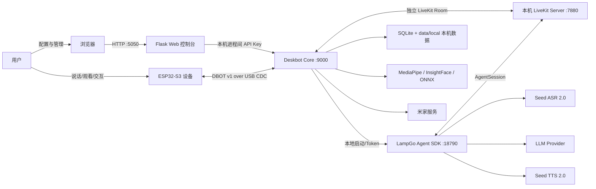
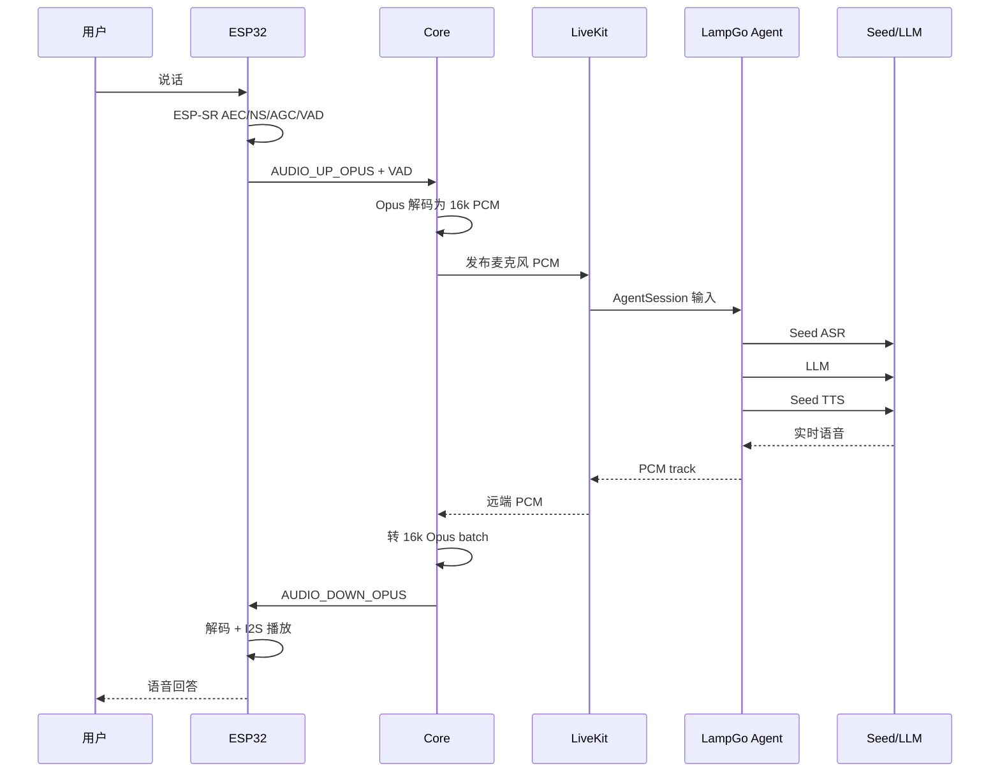

# Open Desk Bot V2 / Deskbot 当前项目架构全景

> 本文描述的是 `open-desk-bot-v2` 仓库 **当前分支工作树中的实际实现**，不是对旧版架构文档的转述。
>
> 审计基线：分支 `fix/audit-p0-p1`（工作树干净，文档与源码同一快照）。发生冲突时以当前源码、当前配置和当前构建产物为准。
>
> 本文不会记录 API Key、Token、Cookie、授权码或图片 base64。
>
> 代码复核日期：2026-08-19。第 26、27 章是 2026-08-05/06 首轮审计的历史验证记录，予以保留；此后仓库又完成了审计 P0–P3 修复与五线清理（桌面客户端、语音链路收敛、固件命令面收窄、相机节奏单写者、核心基建统一等），相关现状已合并进各章正文。

## 1. 一句话定位

这是一个以 **Seeed XIAO ESP32-S3 Sense 桌面机器人**为设备端、以 Windows 本机 Python 服务为控制中枢、以浏览器 Web 控制台为管理界面的多模态桌面机器人系统。

它的核心架构选择是：

- 设备与 PC 之间的唯一业务链路是 **USB CDC**。
- ESP32 固件负责实时硬件、音频前端、编解码、屏幕、舵机、摄像头和播放时间线。
- PC Core 负责设备会话、RTC、ASR/LLM/TTS、视觉、人脸、提醒、工具执行和可靠性状态。
- Web 只负责页面和管理 API，不直接打开串口。
- 一台 PC 只有 `data/local/` 这一份可写业务数据；更换机器人仍使用同一份表情、会话、记忆和设置。
- 所有业务数据直接属于这台 PC；硬件 `device_id` 只用于 USB/RTC/ACK 的运行时路由。
- 实时语音主路径复用了 LampGo/LiveKit Agent 架构，并用 Deskbot 自己的 Seed ASR、LLM、Seed TTS 适配器接入；设备语音只有这一条链路（旧的 WS 传统语音轮已删除）。
- ChatService → LLM 工具循环 → TTS → PB 路径仍保留，用于 Web 文本、提醒等非设备语音入口的结构化工具、表情与动作。

## 2. 系统总览



系统没有让浏览器、云端或任意第二个进程直接抢占串口。Core 是串口的唯一权威所有者。

## 3. 运行时进程与端口

| 端口/链路 | 默认绑定 | 所属进程 | 主要职责 |
| --- | --- | --- | --- |
| `5050` | `127.0.0.1` | Flask Web | 本机页面、配置、运行时目标选择、管理 API、Core 代理 |
| `9000` | `127.0.0.1` | Deskbot Core | USB live session、RTC、非语音对话链路、视觉、PB、提醒、Core HTTP、调试 WS |
| `18790` | `127.0.0.1` | LampGo Agent SDK | 本地 Token endpoint 和 LiveKit Agent worker |
| `7880` | `127.0.0.1` | 本机 LiveKit Server | RTC 信令与媒体；由 Core 自动启动、监测和停止 |
| USB CDC | Windows COM 口 | Core 独占 | ESP32 与 PC 的全部业务数据 |

### 3.1 5050 与 9000 的区别

`5050` 是用户界面层：

- 浏览器直接访问。
- 管理设备、模型、声音、表情、记忆、提醒、人物、米家等。
- 自身不读写 COM 口。
- 需要实时状态或真机操作时，使用本机进程间 API Key（`X-API-Key`）访问 `9000`。

`9000` 是设备和实时能力层：

- 唯一打开串口。
- 维护 USB session、设备在线状态和重连。
- 处理实时音频、相机帧、VAD、PB ACK。
- 提供 Core HTTP API 与浏览器只读调试 WebSocket。

因此，只有 5050 可用时页面可能能打开，但机器人不一定在线；只有 9000 可用时设备可能已连接，但用户管理页面不可用。

### 3.2 18790 的定位

`18790` 不是第三套业务后台。它是 Core 启动的 LampGo Agent SDK 本地辅助进程，负责：

- 本地 RTC token endpoint。
- LiveKit Agent worker 注册。
- AgentSession 的 STT、LLM、TTS 组装。
- 实时语音轮次处理。

Core 停止时应同时回收该进程及其 multiprocessing 子进程。

## 4. 仓库目录与边界

```text
open-desk-bot-v2/
├─ hardware/
│  ├─ firmware/                 ESP32-S3 固件源码
│  ├─ partitions/               8 MB Flash 分区表
│  ├─ scripts/                  构建前契约检查
│  │                             （结构与 PCB 资料见嘉立创开源硬件平台）
│  ├─ diagnostics/              v2 硬件/显示探针诊断固件
│  ├─ platformio.ini            固件构建配置
│  ├─ platformio.local.ini.example  本机构建覆盖示例
│  ├─ flash_rom.sh              build/upload/log/all 工具
│  └─ .pio/                     PlatformIO 生成物（运行时产生）
└─ service/
   ├─ src/deskbot_server/       PC 端产品源码
   ├─ tests/                    Python 测试
   ├─ tools/                    Windows 启动、LiveKit 安装与 USB 诊断工具
   ├─ scripts/                  运维/开发脚本（含 primitive_spec JS 生成器）
   ├─ client/                   Windows 桌面客户端（打包器与 Launcher 源码）
   ├─ data/                     SQLite、只读全局模板与唯一 data/local 本机数据
   ├─ docs/                     项目文档
   ├─ config.yaml               非秘密运行配置
   ├─ pyproject.toml            Python 包与依赖
   ├─ .env                      本机秘密配置，不提交（首次从 .env.example 复制）
   ├─ models/                   本地模型资源（start.sh 首次运行时下载）
   ├─ runtime_logs/             本地运行日志与启动状态（运行时产生）
   └─ .venv/                    本地虚拟环境（运行时产生）
```

以下目录或文件属于生成物/诊断物，不应被当作产品模块：

- `hardware/.pio/`
- `service/.venv/`
- `service/runtime_logs/`
- `hardware/build_logs/` 和散落的 build/upload 日志
- `.pytest_cache/`
- `.ruff_cache/`
- `__pycache__/`
- 测试临时目录和测试数据库

当前源码规模约为（2026-08-19 实测）：

- PC 端 Python：196 个 `.py` 文件（含 `__init__.py`）。
- 固件 C/C++/头文件/.ino：45 个。
- 测试：104 个 `test_*.py`。

## 5. 硬件架构

### 5.1 主控与外设

当前产品目标为 **Deskbot v2 ESP32-S3 自定义板**；PlatformIO 使用
`deskbot_v2` 环境。仓库仍保留 `seeed_xiao_esp32s3` 兼容环境，但它不是本次
构建、烧录和资源统计的目标。v2 主要外设如下：

| 外设 | 实现/规格 | 引脚或说明 |
| --- | --- | --- |
| 主控 | ESP32-S3，带 PSRAM | 原生 USB |
| 显示屏 | ST7789P，物理 `240 × 284` | MOSI 5、SCK 4、CS 6、DC 7 |
| PB 逻辑画布 | `284 × 240` | 固件旋转映射到物理屏 |
| X 轴舵机 | PWM | GPIO 15 |
| Y 轴舵机 | PWM | GPIO 16 |
| 扬声器功放 | MAX98357 | DIN 40、BCLK 41、LRC 42、SD 45 |
| PDM 麦克风 | 16 kHz 单声道采集 | CLK 1、DATA 2 |
| 摄像头 | OV2640，运行时 QVGA `320 × 240` | v2 并口摄像头引脚组 |
| USB D-/D+ | ESP32-S3 原生 USB | GPIO 19/20 |

固件在编译期对显示、舵机、扬声器和麦克风引脚做静态检查，禁止与 GPIO 19/20 冲突。

### 5.2 摄像头参数

摄像头默认使用 sensor JPEG：

- 运行时分辨率：QVGA `320 × 240`。
- JPEG quality：18。
- 默认 frame buffer 数：1。
- 默认不启用连续上传。
- 只有按需快照或显式调试订阅才工作。
- 监听窗口可切换到约 2 秒一帧。
- 固件显式配置白平衡、AWB gain、AEC、gain、gamma、lens correction，以降低偏蓝/偏绿。
- 连续抓帧失败有退避、限频和驱动重建机制。

### 5.3 Flash 分区

8 MB Flash 当前分区：

| 分区 | Offset | Size | 用途 |
| --- | --- | --- | --- |
| NVS | `0x9000` | `0x5000` | 少量耐久状态、完成窗口等 |
| app0 | `0x10000` | `0x6B0000` | 固件 |
| coredump | `0x6C0000` | `0x40000` | 崩溃转储 |
| FFat | `0x700000` | `0x100000` | 本地资源 |

当前分区表已移除历史上的 WADNet 独立模型分区。

## 6. 固件架构

固件位于 `hardware/firmware/`，整体是“USB 主循环 + 多个高实时 FreeRTOS worker”的结构。

### 6.1 启动职责

启动过程依次完成：

1. 初始化日志和运行时守护。
2. 初始化 ST7789 显示。
3. 初始化双轴舵机并回中。
4. 初始化 PDM 麦克风采集。
5. 创建官方 ESP-SR AFE。
6. 初始化 I2S 扬声器和播放 worker。
7. 初始化 Opus 编码、PB Opus 解码和 RTC Opus 解码 worker。
8. 初始化摄像头与按需上传 worker。
9. 初始化 USB DBOT transport。
10. 等待 PC hello，进入设备 session。

设备身份不是烧在固件里的部署变量，而是从工厂 eFuse MAC 推导。所有同型号设备可以使用同一份固件镜像。

**待机屏**：未连接 PC 服务（含 session 结束后）时，display worker 在空闲 tick 中绘制内建默认脸和底部「请连接PC服务」文案（复用既有 wqy12 GB2312 字体）。待机屏只描画像素，不写入表情基线、不参与插值继承、也不进入显示 CRC；hello 处理器清除它，session 拆除时恢复。内建脸因此不再只是硬件故障兜底，而是明确的“未连接”产品状态。

### 6.2 FreeRTOS 任务

| 任务 | 优先级 | 主要 Core | 职责 |
| --- | ---: | --- | --- |
| `audio_play` | 7 | APP | I2S1 唯一写者、播放队列、流式 PCM、终态 |
| `runtime_guard` | 7 | PRO | USB、麦克风、AFE 卡死检测与恢复 |
| `mic_cap` | 6 | APP | I2S0 PDM 唯一读者、20 ms 音频帧 |
| `esp_sr_afe` | 5 | APP | AEC/NS/AGC/VAD |
| `opus_enc` | 5 | Core 0 | 16 kHz 上行 Opus 编码 |
| `opus_dec` | 5 | Core 0 | PB/TTS Opus 解码，PSRAM 栈 |
| `rtc_opus_dec` | 5 | Core 0 | RTC 下行 Opus 解码，PSRAM 栈 |
| `motor` | 3 | APP | 舵机斜坡、队列、取消、PB 终态 |
| `display_render` | 2 | APP | 矢量表情、动画、JPEG、PB 终态 |
| `camera_usb` | 1 | Core 0 | 按需抓帧与 USB 上传 |
| `cpu_stats` | 1 | 不固定 | 运行统计与诊断 |

关键硬件遵守单一所有者原则：

- `mic_cap` 是 I2S0 RX 唯一读者。
- `audio_play` 是 I2S1 TX 唯一写者。
- `display_render` 串行拥有显示渲染状态。
- `motor` 串行拥有舵机状态。
- USB 解析线程不直接等待 I2S、舵机或大计算。

### 6.3 ESP-SR 音频前端

设备端使用官方 ESP-SR AFE，目标管线为：

```text
PDM mic + speaker reference
        ↓
MR / AEC / NS / AGC / VAD
        ↓
clean 16 kHz mono PCM + VAD event
        ↓
Opus uplink
```

其中：

- AEC 使用实际进入扬声器 I2S 的参考音频。
- NS 抑制环境噪声。
- AGC 稳定说话音量；WebRTC AGC 的固定压缩增益通过
  `DESKBOT_AFE_AGC_COMPRESSION_GAIN_DB`（默认 15 dB，可用构建宏覆盖）抬高，
  弥补自适应级只在说话中收敛导致的绑定后首句约 30 秒冷启动电平不足。
- VAD 产生 `speech_start` / `speech_end` 事件。
- AFE 成功时 hello 声明 `audio_aec`、`audio_ns`、`audio_vad_esp_sr`。
- RTC 编解码 worker 成功时声明 `audio_down_opus`、`rtc_audio_gateway`、`rtc_full_duplex`。
- 如果 AFE 创建失败，固件可以降级 raw mic，但 PC 会据此把 RTC 模式降级为 `stable`。

最新修复移除了 AFE 创建后不正确的二次 `enable_aec/ns/vad()` 成败判定，避免官方 AFE 明明已创建，却被误销毁并回退 raw mic。

### 6.4 音频上行与下行

上行：

- PDM 以 16 kHz、单声道、16-bit 采集。
- 每帧 20 ms，即 320 samples。
- ESP-SR 输出 clean PCM。
- Opus 使用 VOIP 模式、低复杂度和约 24 kbps。
- 上行按 3 帧（60 ms）攒批为一个 USB binary（u16_be 长度前缀 + Opus 重复），
  PC 侧解码自适应批长，无固定帧数假设。
- 若 RTC session 有效，音频持续进入 RTC。

下行有两条入口：

- `AUDIO_DOWN_OPUS`：RTC 实时语音专用。
- PB logical binary：传统 TTS/PB 时间线。

两者最终都进入同一 `audio_play` 所有权模型，支持打断、清队列和 I2S 尾音状态。

### 6.5 固件运行时守护

`runtime_guard` 每秒检查：

| 检查项 | 阈值 | 行为 |
| --- | ---: | --- |
| USB poll 无进展 | 15 秒 | 重启 |
| 麦克风任务无读尝试 | 4 秒 | 重启/降级 |
| 麦克风无有效帧 | 6 秒 | 重启/降级 |
| ESP-SR AFE 无进展 | 5 秒 | 重启/降级 |
| 连续健康窗口 | 120 秒 | 清零恢复连续计数 |

外设连续恢复次数达到限制后，不再无限重启，而是进入 degraded 日志状态。

最新修复确保每次有效 USB poll 都更新守护时间戳，避免设备约 16 秒一次误触发 `usb_poll_stall`。

## 7. USB DBOT v1 协议

实现位置：

- 设备：`hardware/firmware/usb_transport.*`
- PC：`service/src/deskbot_server/infrastructure/serial/`

### 7.1 帧格式

DBOT 使用 little-endian 二进制帧：

```text
u32 magic           "DBOT"
u8  version         1
u8  header_size     24
u8  channel
u8  flags
u32 sequence
u32 session_epoch
u32 payload_length
u32 header_crc32
u8  payload[payload_length]
u32 payload_crc32
```

特征：

- header 和 payload 分别有 CRC32。
- decoder 在 header CRC 通过前不信任长度。
- 坏帧会逐字节搜索下一个 `DBOT` magic，自恢复而不是永久失步。
- sequence 和随机 session epoch 防止旧连接、旧 ACK 或重连前数据污染新 session。

### 7.2 通道

| 通道 | 值 | 方向 | 用途 |
| --- | ---: | --- | --- |
| `CONTROL_JSON` | 1 | 双向 | hello、heartbeat、VAD、ACK、控制 |
| `PB_WIRE` | 2 | PC → 设备 | PB JSON 与 logical binary |
| `AUDIO_UP_OPUS` | 3 | 设备 → PC | 麦克风 Opus |
| `AUDIO_DOWN_OPUS` | 4 | PC → 设备 | RTC 下行 Opus |
| `CAMERA_JPEG` | 5 | 设备 → PC | 摄像头 JPEG |
| `LOG` | 6 | 设备 → PC | 设备日志 |

### 7.3 Session 与可靠性

- PC 发起 hello，包含随机 epoch 和 client nonce。
- 固件返回设备 ID、能力和固件信息。
- 一个 session 只有一个 reader 和一个有序 writer。
- heartbeat 维护存活。
- generation fencing 防止旧连接 callback 写入新设备状态。
- 默认扫描明确配置的 COM 口；未指定时只自动探测 Espressif VID `0x303A`。
- 断开后指数退避重连。
- 具备 `session_end` 能力的固件在链路仍可写时会主动发送
  `{"type":"session_end","reason":...}` 告知帧；PC 收到后立即结束该 session
  并以新 generation 重连，不再等心跳超时。旧固件不发送该消息。
- PB logical binary 会切成不超过 2048 bytes 的物理发送片段。
- 本机 CONTROL JSON 命令面只保留 factory 只读查询与维护命令
  （`head_pos`、`task`、`reboot/restart`）；旧的手势/动作命令层已删除。

## 8. PC Core 内部模块

`service/src/deskbot_server/` 的主要分层：

| 包/模块 | 职责 |
| --- | --- |
| `main.py` | 进程组装、启动和关闭（SIGBREAK/SIGTERM 优雅关闭） |
| `core/` | 端口协议、设置、并发、领域类型、`clock.py` 统一 UTC/时区权威、`json_store.py` 通用 JSON 文档存储 |
| `application/` | 聊天、工具、提醒、视觉、仲裁、`camera_cadence`（相机节奏单写者）、`voice_link_feedback`（语音未就绪反馈）等用例 |
| `auth/` | 本机进程间 API Key（`api_key_service`）与调试 WS 短期 token（`debug_ws_token`） |
| `infrastructure/serial/` | USB 协议、session、扫描、hello/能力集成 |
| `infrastructure/asr/` | 火山豆包流式、OpenAI compatible、FunASR（配置测试/文本兼容路径） |
| `infrastructure/llm/` | OpenAI-compatible LLM |
| `infrastructure/tts/` | 豆包 TTS 适配 |
| `infrastructure/ws/` | USB DeviceSession 的 downlink 适配（`half_duplex_media_mic`） |
| `pipeline/` | Opus 编解码运行时、上行批解码与麦克风健康监测（服务端 VAD 与传统 WS 语音轮已删除） |
| `rtc_*.py`、`local_livekit.py` | 本机 LiveKit Server、Agent SDK、RTC USB binding、gateway |
| `pb/` | PB 场景、表情、动画、舵机、口型、wire、`primitive_spec`（三端图元协议单一来源）、`cam_signal` |
| `vision/` | 人脸 embedding、几何、去畸变、生成 |
| `ws/` | Core HTTP（`http_api.py`）、浏览器调试 WS 路由（`router.py`）、registry、ACK、`api_key_gate` |
| `web/` | Flask 页面和管理 API |
| `db/` | SQLAlchemy 本机 API Key、提醒、回执、操作状态和用量 schema |
| `iotctl/`、`miot_*.py` | 米家授权、缓存和工具执行 |
| `*_store.py` | 原子 JSON 数据存储 |

### 8.1 Core 启动编排

`main.py` 的顺序是：

1. 读取 `.env`。
2. 应用待生效的 LLM 配置 revision。
3. 初始化 SQLite 并确保 `data/local/` 初始化。
4. 读取 `config.yaml`（含 debug prefs 一次性迁移）和环境变量覆盖。
5. 组装 ASR/LLM/TTS ChatService。
6. 创建 DeviceRegistry、AsrChatHub、DevicePipelineBroker、CameraPreviewLeaseManager。
7. 创建 CameraImageBroker 和人脸运行时。
8. 启动 LLM 配置 watcher、控制操作 retention 循环，并把 **RTC 栈整体放入后台任务**
   （本机 LiveKit Server → LampGo Agent SDK → 安装 RTC gateway）。Windows 冷启动
   时 Agent SDK 导入可超过 20–30 秒，后台化让 USB、调度器与 `:9000` 立即可用；
   gateway 安装前接入的设备由 RTC binding 自行重试恢复。
9. 启动 SerialServiceBridge。
10. 启动提醒 scheduler。
11. 在 `:9000` 启动 Core HTTP 和浏览器调试 WS，然后等待关闭信号。

关闭由 SIGBREAK/SIGTERM（或 KeyboardInterrupt）触发，顺序是：

1. 取消后台 `rtc_startup` 任务（防止关闭中途 gateway 才被安装）。
2. 停 scheduler 并释放租约。
3. 关闭相机预览租约管理器。
4. 停串口 bridge。
5. 关闭所有 RTC binding（`shutdown_rtc_runtime`）。
6. 停 Agent SDK 及子进程。
7. 停本机 LiveKit Server。
8. 停 LLM 配置 watcher 与 retention 任务。

各段以嵌套 try/finally 保证前一步失败不会跳过后续回收；Agent SDK 与本机
LiveKit 的子进程收尾各有最多约 5 秒等待，Windows 桌面客户端据此给整个进程组
15 秒优雅退出窗口。

## 9. RTC 实时语音主链路

### 9.1 RTC 建连

USB hello 完成后：

1. `SerialServiceBridge` 立即启动 USB `handle_asr_chat` 消费循环。
2. 立即下发 `mic=open` 恢复信号，并让 hello 回调返回；USB RX 不等待云端。
3. 独立后台任务从 hello capabilities 判断 RTC 能力并连接 LiveKit。
4. 为设备创建独立 LiveKit room。
5. 创建 16 kHz 单声道音频 source 并发布麦克风 track。
6. LampGo worker 进入房间。
7. 订阅 Agent 下行音频 track。

每台设备使用独立 room，避免跨设备音频和状态互串。RTC token/room 建连即使耗时数秒，也不会阻塞 USB heartbeat、VAD 和首轮音频；本地 binding 一创建就接管音频并用有界队列保存连接期间的 PCM。RTC gateway 尚未安装时 bind 会等待并重试，RTC 被显式关闭时等待中的 bind 被释放。设备断开或服务停止会取消对应 bind task，并清理未完成的 gateway/session。

**语音未就绪反馈**：RTC 冷启动窗口（Agent 导入、gateway 迟装、binding 进行中）
内用户开口时，ESP-SR `speech_start` 会触发一条节流的「语音启动中…」短表情
（thinking 场景、约 2.5 秒短 lease、每设备最小间隔 8 秒、低优先级绝不抢占真实
内容源），让设备不至于看起来没反应。该反馈 fire-and-forget，不阻塞 VAD 处理；
勿扰时段不影响它（勿扰只约束提醒类下发），自动应答开关关闭时则直接跳过。

### 9.2 实时语音时序



### 9.3 Seed ASR、LLM、Seed TTS 的关系

RTC 不是替代 ASR/LLM/TTS，而是把三者放进连续的实时会话框架：

- Seed ASR 2.0：把实时音频转成文本。
- LLM：基于文本、角色 prompt 和上下文生成回答。
- Seed TTS 2.0：把回答文本转回实时音频。
- LiveKit：负责房间、track 和实时媒体传输。
- LampGo AgentSession：负责轮次、流式调度和可选打断。
- Core：负责 USB 与 LiveKit 之间的音频网关。

三类凭证相互独立：

- `ASR_API_KEY`：Seed ASR。
- `LLM_API_KEY`：LLM。
- `DOUBAO_TTS_API_KEY`：Seed TTS。

不应复用或互相回退。

### 9.4 RTC 模式

配置可请求：

- `stable`
- `interruptible`
- `esp32_aec`

`esp32_aec` 只有设备同时声明以下能力才真正启用：

- `audio_aec`
- `audio_ns`
- `audio_vad_esp_sr`
- `rtc_full_duplex`

否则自动降级 `stable`。

`interruptible` 同样要求 full duplex。`interruptible` 与能力协商成功的 `esp32_aec`
都会开启 AgentSession interruptions。设备原始 VAD 只标记上行帧并更新监听状态，
不直接截断远端播放；只有 AgentSession 确认的 barge-in 才会同时取消 Core 与固件
旧下行，避免扬声器尾音或安静房间的短 VAD 边沿误杀回答。barge-in 判定含 CJK
感知门（3 个汉字或 0.6 秒语音即可触发，不再依赖按空格分词的 4 词阈值）。缺少
AEC/full-duplex 能力的设备降级为 `stable`，播放及尾音窗口会关闭麦克风上行。

### 9.5 RTC 与传统链路并存

物理设备语音只保留 RTC 一条链路。USB binding 从创建开始就接管该设备音频；本地
room 已连接但 Agent/远端音轨未附着时不会伪报健康，也不会偷偷启动第二套
ASR/LLM/TTS。系统会保留有界 PCM、重试绑定并显式暴露 RTC 未就绪，而不是让同一句话
同时进入两套识别。

当前重要差异：

- RTC prompt 以可朗读回答为主，普通回答经 LiveKit 音频直通。
- RTC worker 已注入结构化 Deskbot 工具，但不复制 Core 内存态或自行写 PB；它通过
  随机进程级凭证保护的 loopback bridge 调用 Core 的权威工具执行域。
- `play_expression`、`move_head`、相机、记忆、提醒、会话、
  米家、Web 和临时文件工具都能从 RTC 进入 Core；风险确认仍由 Core 强制执行。
- 传统 ChatService 仍负责更完整的 JSON 响应、TTS 音素对齐和任意组合 PB 时间线；
  两条入口最终共用本地数据、设备执行 lane、PB 构造器和终态回执。

## 10. 非设备 RTC 的 ChatService / PB 兼容链路

ChatService、工具循环、TTS 音素对齐和 PB 时间线仍用于 Web 文本输入、提醒、手工控制
及其他非 RTC 入口：

```text
Web/内部文本或已确认的 ASR 文本
  → ChatService / LLM tool loop
  → TTS + phoneme alignment
  → PB timeline
  → ESP32 audio/display/motor
```

ASR provider 组件仍可用于配置测试和非设备调用：

- `doubao_streaming`：当前默认。
- `openai_compatible`：兼容云 ASR。
- `funasr`：可选本地 ASR，需要额外依赖。

它不是物理 USB 设备的第二条自动 fallback；**设备实时语音固定使用豆包流式
ASR（RTC 内硬编码），不随该选择切换**，控制台的 provider 选择只影响连通性
测试与文本兼容路径。TTS 当前产品运行时是豆包 Seed TTS 2.0，默认 16 kHz 输出。
LLM 通过 OpenAI 兼容接口访问“通用大模型”，控制台提供 DeepSeek / 豆包
（火山方舟）/ Xiaomi MiMo 三个预设并支持自定义 base URL；出厂默认为 MiMo
`mimo-v2.5`，全部调用路径固定关闭深度思考（`thinking: disabled`）。

## 11. 摄像头与舵机完全隔离

摄像头、人脸检测、身份识别、VAD/ASR 状态都不再产生舵机命令。相机负责提供图像问答、
显式拍照、人脸登记和调试元数据；舵机只响应 Web 手工控制、RTC `move_head`、经过校验的
语义动作预设和场景编排。

### 11.1 已删除的自动动作

- 没有默认每 10 秒持续拍照。
- 摄像头常态上传间隔是 0。
- 设备连续帧率的**唯一真值**由 PC 侧 `CameraCadenceController` 单写者计算：
  期望 fps = max(预览租约 fps, 有界拍照 boost fps)。浏览器 `/camera_view` 的预览
  订阅按设备引用计数持有 2 FPS 租约，最后一个订阅断开归零；拍照兜底流只声明
  有界的临时 boost，退出时自动恢复租约期望值，任何写者都不会广播掐死别人流的
  裸 0；USB 重连会为仍有效的预览租约重发节奏命令。
- **PB `cam_fps` 的唯一生产者是 CameraCadenceController**（预览租约与有界
  capture boost 的合并值；LLM 可写通道已在服务端源头删除）。固件按
  0..65535 校验后调用 `camera_set_fps`，fps=0 停止预览；RTC/LLM 拍照统一走
  `camera_once`，不改变预览节奏。
- 相机 pipeline 只产出检测、跟踪与识别元数据，不自动驱动舵机。
- confirmed-speech 拍照找人和人脸位置校正已删除。
- LLM 等待、失败等待、随机口播伴随动作已删除。
- 空闲自动转头、主动低头和自动打盹已删除，相关配置与页面入口也不再保留。

仍保留：

- 人脸检测、跨帧跟踪和身份识别。

视觉结果只作为会话元数据、显式工具结果和调试信息，不能转换为舵机动作。

## 12. 视觉与人脸系统

### 12.1 视觉管线

USB `CAMERA_JPEG` 到达 Core 后：

1. 校验 JPEG。
2. 更新最近帧缓存。
3. 可推送浏览器 `/camera_view` 订阅。
4. MediaPipe Face Landmarker 检测关键点。
5. 用 InsightFace/ONNX 生成 512 维人脸 embedding。身份识别是 **embedding-only**：
   旧的 9 维几何 descriptor 及其阈值链已删除；InsightFace 不可用时人脸仍被检测
   与跨帧跟踪，但不做身份匹配，注册会显式失败而不是静默存几何。
6. FaceTracker 做跨帧关联。
7. 与持久化人脸档案比对。
8. 生成 face metadata 供会话、工具或调试使用。

### 12.2 FaceTracker

Tracker 使用：

- 鼻尖位置距离与 bbox/IoU。
- `face_id` 单调递增。
- `person_id` 滞回锁定，降低来回跳人。
- 多脸画面禁止同一 `person_id` 同时绑定多个 track。

### 12.3 视觉—运动隔离边界

视觉模块不注册 `look_at_person`、`set_camera_follow` 或任何人脸驱动的运动工具；
`capture_camera` / `capture_and_describe` 的结果不能被转换为舵机坐标。用户若要转头，
必须明确调用 `move_head` 并从本机模型可见动作 catalog 中选择语义预设。

### 12.4 图片隐私

一次性 `capture_camera` 的图片只瞬态进入下一轮 provider request：

- 不写普通日志。
- 不写会话文本。
- 不写工具 operation ledger。
- 不持久化 base64。
- 默认 `display=false`，只有用户明确要求拍照并显示时才回显设备屏幕。

## 13. PB v2.1 多模态播放

PB 是传统下行的统一时间线，音频、屏幕、口型、图片和舵机不分别“随缘执行”，而是共享一套 request、chunk 和终态。

### 13.1 消息

- `pb_start`
- `pb_chunk`
- `pb_end`
- `pb_single`
- `pb_cancel`

### 13.2 时间线内容

一个 chunk 可以包含：

- 音频 logical binary。
- `anim` 表情/口型。
- `servo` 舵机动作。
- 图片 asset。
- 对齐时间和持续时间。

约束：

- `audio.next_bin_len` 精确声明下一段 logical binary 长度。
- `idx` 严格递增。
- `anim.ms` 之和要与 `chunk_ms` 对齐。
- 音频、显示、舵机按同一 absolute start timestamp 启动。

### 13.2.1 表情绘制契约

图元协议数据（shape 主名与别名、颜色解析规则、图层语义、内建默认脸）有单一
来源 `pb/primitive_spec.py`：Python 端直接 import；Web JS 由
`scripts/gen_primitive_spec_js.py` 生成 `web/static/generated/primitive_spec.js`；
手写 C++ 固件无法 import，由 `tests/test_primitive_spec_lockstep.py` 抽取固件
源码逐项断言锁步。表情颜色在服务端按严格白名单归一化为 `#rrggbb`（非法值落回
图层默认色），封死经 `v-html` SVG 的存储型 DOM-XSS。

Web 编辑器、服务端 wire 归一化和固件渲染遵守同一组语义：

| 语义 | Web / 本地场景 | PB wire / 固件 |
| --- | --- | --- |
| 画布与图层 | `284 × 240`；`bg → nose → mouth → eye_l → eye_r → extra` | 固件按相同顺序合成和绘制 |
| 跨帧继承 | 缺失图层键继承上一帧；显式 `[]` 只清该层 | 固件先复制已提交层，再覆盖本帧出现的数组 |
| shape | 页面接受固件支持的规范名和兼容别名；设备场景不渲染 `svg_path` | 服务端先归一化并拒绝固件不支持的图元；例如 `draw_line` / `drawLine` → `line` |
| 颜色 | 页面可用 CSS/十六进制颜色，并按图层使用统一缺省色 | wire 使用 `c` 的 RGB565 整数；眼、鼻、嘴、extra 的缺省色与页面一致 |
| 图元上限 | 每层最多 16 个；画笔与腮红、眉毛、泪滴等共享 `extra` 额度 | 服务端保存与下发均逐层校验；固件超限明确失败，不再静默截断 |
| 动画 | Web 在当前帧 `ms` 内按同层同下标图元插值 | 固件使用相同插值规则，首个 replace 帧不从旧来源的脸插值 |
| 描边与旋转 | `stroke_width`/`sw` 为 1～12；`rotation`/`angle` 和可选 pivot | 固件使用相同宽度、角度与中心语义；旋转矩形的 `x,y` 是中心 |
| image asset | 当前请求内按 `asset` 下标引用 | 无效或跨请求资产不继承并被跳过，不能误用旧 JPEG |
| 空帧/失败 | 预览呈现合成结果 | 合成后无可绘图元或播放失败时保留上一张合法画面；正常 replace 保持旧像素到新首帧，不插入内建脸 |

完整字段和 shape 表见 [esp32_pb_protocol.md](./esp32_pb_protocol.md)。

### 13.3 优先级和动作

PB level：

- 0：idle。
- 1：task / 普通口播。
- 2：emergency。
- 3：debug。

action：

- `replace`
- `append`
- `default`

### 13.4 ACK 与终态

状态含义：

- `enqueued`：服务端已排队。
- `accepted`：设备接受了请求，但不代表播完。
- `played`：设备确认已完成播放。
- `failed`：失败。
- `cancelled`：取消。

因此 HTTP `202 Accepted` 和设备 `accepted` 都不是用户已经听到提醒的证明。

普通聊天在 RAM 内做重复 request 去重；提醒和控制等 durable 操作还使用有界 NVS 完成窗口，减少重连重播。

## 14. 每个 live 连接的执行仲裁

`DeviceTurnArbiter` 为每台设备维护一条权威执行 lane。

当前优先级：

| 来源 | 优先级 |
| --- | ---: |
| automation | 10 |
| reminder | 20 |
| manual | 60 |
| interactive speech | 100 |

行为：

- 交互语音可以抢占可中断的低优先级动作。
- 同一 replace group 中，新的待处理语音可以替换旧的待处理语音。
- 已经开始执行的用户语音，不会被另一条普通用户语音直接取消。
- 提醒、手工调试和交互语音不会同时无序写设备。

## 15. LLM、工具与风险确认

### 15.1 当前工具

通用 tool runner 当前执行：

- `register_face`
- `capture_camera`
- `memory_add`
- `memory_delete`
- `schedule_task`
- `session`
- `miot` / `mihome` / `mijia`
- `webfetch`
- `websearch`
- `read`
- `write`

工具名唯一；旧的 `get_camera_frame` / `camera_capture` 拍照别名已删除，
拍照只有 `capture_camera` 一个名字。

异步视觉/设备执行域还提供：

- `capture_and_describe`：RTC 中对一张新鲜瞬态图片提问。
- RTC 适配器 `play_expression`、`move_head`：复用本地表情库、舵机预设和 PB 终态。
  舵机限位、reverse 与 preset 的完整契约由 `GET /api/servo_contract` 对外暴露，
  并有固件锁步测试（`test_servo_contract_lockstep.py`）保证三端一致。

人脸检测、跟踪、身份识别和图片问答不会启动或间接生成任何舵机动作。

### 15.2 需要明确确认的操作

以下操作需要用户明确确认：

- 注册人脸。
- 删除记忆。
- 写临时文件。
- 删除/清空 session。
- 删除提醒。
- 米家所有非只读操作。

确认机制包括：

- 对规范化 payload 做 hash。
- confirmation 与本地会话、操作类型和规范化载荷绑定。
- 一次性消费。
- 有过期时间。
- operation ledger 防止重复副作用。
- 结果不确定时标记 `unknown`，禁止盲目自动重放。

### 15.3 网络与文件工具边界

- `webfetch` 阻断 loopback、内网和 metadata 地址。
- Provider 默认必须使用公网 HTTPS/WSS。
- DNS 解析结果会被校验并 pinning，降低 DNS rebinding 风险。
- `read` / `write` 只能访问 `data/local/tmp/`。
- 禁止绝对路径和 `..`。

## 16. 提醒系统

提醒支持：

- 一次性时间。
- cron 周期。
- 创建、编辑、暂停、恢复、重试、删除。

可靠性机制：

- 每 2 秒轮询。
- 数据库 lease 默认 120 秒。
- 大约每 30～40 秒续租。
- fencing token 防止旧 worker 提交新租约持有者的结果。
- 启动时恢复过期 `running` lease。
- orderly shutdown 主动释放 lease。

设备离线策略：

- `retry_within_grace`
- `expire`
- `deliver_when_online`

勿扰时段（`/preferences` 的 quiet hours，含用户时区）内到期的提醒不会被丢弃或
硬试：调度器把它 defer 到勿扰窗口结束后再播报（加约 1 秒余量避免重新落回窗口
内），并记录“勿扰时段内暂缓提醒”摘要。勿扰只约束提醒类下发，不影响用户主动
对话与语音未就绪反馈。

防重复播放：

1. 设备返回 `played`。
2. 先持久化 immutable playback receipt。
3. 再完成 scheduled task 状态。
4. 如果进程在两次提交之间崩溃，重启后从 receipt 恢复，不重新播。

提醒执行也使用同一 `local` 数据空间；调度元数据与对话文本分开记录，不创建第二套
会话 scope。

## 17. 本地会话、记忆、人物与运行时连接

### 17.1 Session

产品只有 `local` 这一种持久会话 scope。功能包括：

- 新建、轮换和激活本机会话。
- 10 分钟无对话可自动切新 session。
- 查看详情、清空、删除和导出 JSON。
- 人脸识别结果可作为当前轮上下文，但不会选择另一套 session 或数据目录。

### 17.2 长期记忆

- 统一保存在 `data/local/`。
- 所有接入这台 PC 的机器人共享同一份记忆。
- 支持增删改查，并在 LLM system prompt 组装时注入。
- 删除属于风险操作，需要明确确认。

### 17.3 人脸档案

- 统一保存在 `data/local/`，不按硬件分库。
- 支持注册、改名、删除。
- 档案包含 identity 信息和 512 维 embedding（不再存几何 descriptor）。
- Tracker 的短期 `face_id` 与长期 `person_id` 分开；二者只用于人脸上下文。

### 17.4 运行时设备连接

- USB hello 后自动形成 live session。
- 单设备自动成为当前目标；多设备只在页面选择动作/调试的路由目标。
- `device_id` 用于 USB、RTC、PB ACK、流水线过滤和诊断，不参与持久化路径。
- 拔线只结束该 live session；`data/local/` 保持不变。
- 任意兼容硬件随后接入，都会继续使用这台 PC 原有数据。

## 18. 表情、声音与米家

### 18.1 表情系统

当前表情页包含：

- 系统示例表情。
- 用户保存的表情库。
- 统一左侧预览。
- 眼距、眼高、眼大小、眯眼。
- 嘴高、嘴宽、嘴厚、嘴角。
- 眼睛和嘴巴统一主色。
- 图片生成表情。
- 专业 JSON/AI 设计。
- 音素口型。
- 情绪到表情映射。
- 设备预览。

保存逻辑：

- 用户明确修改名称时使用用户名称。
- 未修改名称时以当前表情名生成版本名，例如“生气（1）”。
- 保存项进入用户表情区域，不覆盖系统示例。
- 用户表情可重新打开、编辑和删除。
- 系统表情使用 `origin=system`，只能“复制到我的表情”；用户表情使用稳定、由服务端分配的 ID 和 `origin=user`。
- “更新当前表情”和“另存副本”是两个明确动作，不再用名称前缀猜测所有权。
- 编辑器保留场景的全部帧、时长、图层和图元；打开再保存不会退化为首帧。
- 设备预览是纯运行时下发，不保存场景、不修改 `idle` 映射。
- 一个表情可以包含多帧；设备按全部帧和各自 `ms` 播放，结束后保持最终帧。页面的帧计数和
  播放按钮用于区分“同一表情内部动画”与“运行时切换到另一个表情”。
- 点击“发送到设备”不会自动播放 Web 本地动画来伪装设备时间线；请求完成后 Web 直接停在
  设备确认的最终帧。本地播放按钮仅是编辑预览，不代表设备同步播放。

当前存储边界：

- 可编辑面部设计保存在 `data/local/deskbot-face.json`；schema v2 将 `revision`、`mappings`、`phonemes`、`emotions` 放在同一原子文档中。
- `data/global/deskbot-face.json` 只作为只读系统模板和首次初始化种子，页面与运行时都不回写。
- `emotion_expr_map.json` 只作为旧安装的一次迁移来源；运行时与页面都读取 `deskbot-face.json.mappings`，不会再出现双文件半保存。
- 页面通过带 `expected_revision` 的事务 API 增量创建、更新和删除；并发冲突返回 409，不再整库覆盖。
- 设备预览仍需选择一个 live USB 目标，但预览选择不改变表情库。
- 换机器人、换串口或重连不会复制、重置或切换表情数据。

#### USB 表情运行时

- `RtcExpressionRuntime`（保留历史类名）是 USB 会话级的统一显示来源仲裁器；它在
  USB ready 时创建，不依赖 LiveKit 是否启用、设备是否具备 RTC capability 或 RTC 是否
  已连通。RTC 生命周期、Web 预览、
  Agent 显式表情和开机苏醒都从这里进入同一个 latest-wins 串行队列。
- RTC 始终记录最新 `desired_state`。Web/Agent/boot 持有临时 lease 时，自动
  listening/thinking/speaking/idle 只更新期望值而不抢屏；lease 结束恢复最新期望值，
  不再硬编码追加 idle。
- 用户开始说话和 barge-in 会立即结束显式 lease 并显示 listening；确认说完切 thinking；
  `initializing` 不再覆盖开机苏醒。listening/thinking 只发送短入场动画，末帧由固件保持。
- Web 优先级高于 Agent，新的同级显式请求替换旧请求；固件 normal replace 不插入内建
  idle，因此 Web 下发过程中不会再依次闪过旧 RTC 脸、内建脸和目标脸。
- 完整换脸只有统一运行时一条入口。运行时分别保存最近 32 次“操作”和最近 32 次设备
  `played` 的完整脸：`accepted` 只表示候选请求已入设备，不会覆盖当前脸；只有最终
  `played` 才更新 `displayed_expression`。后台候选若失败或被更新请求覆盖，只更新操作历史，
  不能再把旧候选冒充成当前脸。
- 每条记录包含来源、原因、operation ID、lifecycle state、帧数、总时长、最终帧序号、
  完整时间线 SHA-256 和最终帧 SHA-256。因此 idle/listening/thinking 等多帧动画看起来像
  “几个表情”时，可以先区分它究竟是同一动画的不同帧，还是另一个来源真正完成了一次换脸。
- 生命周期重复通知会在 LiveKit gateway 和统一运行时两层去重；同一状态正在执行或排队时，
  后来的重复事件只记为合并，不取消并重放原动画。
- 固件在最终 `StoredLayer` 提交后，按 shape enum、RGB565、整数截断、固定图层顺序、文本和
  图片资产内容独立计算语义 CRC32，并通过 terminal `pb_ack.display_crc32` 回报；服务端按同一
  规范计算 expected CRC。图片图层按固件每个 display chunk 的独立资产表语义组合；纯音频/
  舵机 chunk 不会错误清除图片。Web 将“该 operation 自身是否执行/CRC 一致”和“当前屏幕后来
  归哪个 operation/source”分开显示：缺 CRC 标为“未确认”，同操作 CRC 不同标为“协议不一致”，
  后续完整脸到达则保留原操作结果并标明“已覆盖”。这证明设备解码后的渲染状态，不等价于
  摄像头对屏幕像素的光学校验。
- 固件的 completed-request RAM/NVS 回执同时保存最终显示 CRC；同一 durable 请求重试或设备
  重启后的 `played` 重放仍可完成一致性核验。存储格式升级为 v2，旧版无 CRC 记录会被忽略，
  不会伪造匹配结果。
- 默认 `speaking → idle`：说话阶段保持待机基准脸，只允许固件叠加实时嘴型，不再每轮自动
  切到 `happy`。`listening` 与 `thinking` 仍是明确的语音生命周期完整表情。
- 显式 lease 至少覆盖实际 PB 播放时长并增加 500ms 末帧保持裕量；Web 页面下发的
  ad-hoc 帧、表情场景、通用 PB 场景和表情库场景全部走同一仲裁入口。
- Agent 的模型 schema 不再发布 idle/listening/thinking/speaking，且明确只在用户要求
  展示表情时调用；设备完整接收后即可向模型返回 `accepted`，最终 `played` 在后台
  继续确认，避免表情工具阻塞语音回答数秒。
- RTC 下行 PCM 在固件本地计算 0～4 档能量口型，只重绘当前基础脸的嘴部；不发送高频
  PB、不替换整张脸，播放结束恢复原嘴型和原完整脸背景色。
- 传统 TTS 的音素动画同样只写 mouth layer。Web 状态卡把 RTC 实时口型与 TTS 音素口型
  标成“完整脸未切换”，两者都不增加表情历史 generation。
- `run_device_tts_only` 已删除旧 `anims` 参数；普通 LLM 输出的旧 `anims/scenes` 固定清空，
  playbook 先调用 expression runtime，再让 TTS 仅承载声音、`mouth_only` 口型和舵机。
- 完整 replace 清空旧图层继承基线；只有显式 `mouth_only` 才继承当前完整脸并在音素结束后
  恢复原嘴型，RTC 实时嘴型也只在固件本地叠加，不进入完整换脸历史。
- 只有图片、没有文字和舵机动作时，服务端仍会建立一条 3 秒显式图片 PB；图片获得独立
  display lease，成功、失败或取消后统一重绘最新 `desired_state`。多段 TTS 只记录一次图片显示。
- `DISPLAY_SCENE_RESET` / `display_render_reset()` 隐藏换脸入口已删除。内建默认脸
  现在承担**待机屏**职责：未连接 PC 服务时由 display worker 空闲绘制内建脸加
  「请连接PC服务」文案，hello 后清除、session 结束恢复；待机屏只描画像素，
  不写入 PB 表情基线、插值继承和显示 CRC，因此对表情来源仲裁完全不可见。
- RTC Worker 只提出工具调用；场景解析、PB 构造和物理 USB 写入始终由 Core 完成。

### 18.2 声音

声音页支持：

- 豆包音色库。
- 试听。
- 设为这台 PC 的当前音色，并应用到当前 live 设备。
- 声音复刻提交。
- 复刻状态轮询。
- 复刻结果应用。

普通 Seed TTS API Key 与复刻所需的 App ID / Access Token 分开管理。

### 18.3 米家

米家配置保存在 `data/local/`，所有接入设备共享：

- 获取授权 URL。
- 粘贴授权码完成绑定。
- 同步家庭、房间、设备和场景。
- 授权续期。
- 解绑。
- 查看属性和 spec。
- 写属性、调用 action、运行场景。

米家写操作通过 LLM 工具时必须确认。

## 19. Web 页面与用户功能

### 19.1 主要页面

| 路由 | 页面职责 |
| --- | --- |
| `/home` | 当前 USB 状态、相机、打招呼、记忆/提醒/人物/表情/模型摘要 |
| `/voice` | 本机音色库、试听、当前音色、声音复刻 |
| `/expr` | 系统示例、用户表情库、捏脸、AI/JSON 设计、设备预览 |
| `/lab` | 3D 舵机、真机舵机、相机订阅、PB、场景、TTS、pipeline 日志 |
| `/memories` | 长期记忆 CRUD |
| `/reminders` | 提醒 CRUD、暂停、恢复、重试 |
| `/sessions` | 会话查看、新建、激活、清空、删除、导出 |
| `/preferences` | 主动行为、勿扰、离线提醒策略和本机音色 |
| `/people` | 人脸档案改名和删除 |
| `/devices` | live USB 自动发现、在线状态和运行时目标选择 |
| `/miot` | 本机米家授权、同步、房间设备和解除授权 |
| `/advanced` | 本机用量、LLM、Seed ASR、Seed TTS、供应商凭据和调试入口 |
| `/onboarding` | 兼容入口，重定向到 `/advanced?tab=llm` |

### 19.2 前端技术

- Flask server-side templates。
- 本地打包的 Vue production runtime。
- `theme_2c.css` 作为当前 2C 主视觉。
- `base_2c.html` 提供统一侧边栏和页面壳。
- 页面通过 Flask API 和 Core 代理完成读写。
- 摄像头与 pipeline 日志通过短期认证的调试 WebSocket 获取。

## 20. 数据持久化

### 20.1 SQLite

默认数据库：

```text
service/data/opendesk.db
```

当前业务表：

| 表 | 用途 |
| --- | --- |
| `api_keys` | 本机进程间凭证元数据（配合 `data/.free_api_key` 文件） |
| `usage_daily` | 本机每日 ASR/视觉/LLM/TTS 汇总用量（计入每日字节配额） |
| `devices` | 运行时设备记录 |
| `scheduled_tasks` | 提醒、cron、lease、结果（datetime 统一按 naive-UTC 落库） |
| `playback_receipts` | 不可变播放回执 |
| `tool_operations` | LLM 工具副作用 ledger |
| `tool_confirmations` | 一次性风险确认 |
| `control_operations` | 异步设备控制状态 |
| `voice_clone_jobs` | 声音复刻任务 |
| `voice_clone_poll_throttles` | 复刻查询限流 |
| `settings_test_daily` | 配置测试日限额 |

### 20.2 本地数据

```text
service/data/local/
```

主要文件：

- `interaction_preferences.json`
- `device_volume.json`
- `doubao_tts_speakers.json`
- `llm_models.json`
- `.llm_config_state.json`
- `memories.json`
- `face_profiles.json`
- `emotion_expr_map.json`（仅作为旧安装的一次迁移来源）
- `scene_playbooks.json`
- `servo.json`
- `camera_face.json`
- `deskbot-face.json`
- `debug_prefs.json`（运行时可写调试偏好，如自动应答开关；已从 `config.yaml` 迁出）
- `livekit/`（本机 LiveKit Server 密钥与配置，忽略提交）
- `session/{session_id}.json`
- `session/_meta.json`
- `tmp/`
- `miot/`

另有 `data/.free_api_key`（`data/local/` 之外）：本机进程间凭证文件，Web 等本机
进程凭它访问 Core；配套每日 1 GiB 字节配额只是本机资源保护，不是商业化额度。

时间口径：数据库与 JSON 中的 datetime 一律按 UTC 落库（`core/clock.py` 是唯一
时间权威；`scheduled_tasks` 通过 PRAGMA `user_version` 迁移把旧 naive-CST 列统一
为 naive-UTC，迁移前自动备份），只在序列化/展示边界转换为用户偏好时区（默认
东八区兜底）；cron 表达式保持用户时区的挂钟语义。

旧版本的 `user_memory.json` 只在 `memories.json` 尚不存在时，于第一次读取
长期记忆时原子迁移到新文件名；已经存在的新文件永远不会被旧文件覆盖。

以上文件属于这台 PC，不属于某个硬件。全局数据：

- `data/global/deskbot-face.json`（只读模板/本地初始化种子）
- `data/global/camera_face.json`
- `data/global/llm_system.txt`

### 20.3 原子写

跨 Web/Core 进程共享的 JSON 不直接原地覆盖，而是：

1. 获取跨进程 file lock。
2. 写临时文件。
3. flush + fsync。
4. 原子 replace。
5. 必要时刷新内存 cache。

这样可避免 Core 正在读取时，Web 写到一半产生截断 JSON。

## 21. 本机访问与凭据边界

### 21.1 本机默认

- 5050/9000 默认只绑定 loopback。
- 页面直接提供本机功能，不创建用户、角色或身份会话。
- Web 若尝试绑定非 loopback，直接拒绝启动。
- Host header 只接受明确的 localhost/loopback。

### 21.2 浏览器请求

- 写请求检查 `Sec-Fetch-Site`。
- 检查 Origin。
- 设置 CSP：`script-src 'self'`（保留 Vue DOM 运行时所需的 inline/eval）、
  `object-src 'none'`、`frame-ancestors 'none'`。
- `X-Frame-Options: DENY`。
- `X-Content-Type-Options: nosniff`。
- 设置 Permissions-Policy。
- 无外部 CDN 依赖：three.js/Vue 均本地打包，Google Fonts 已替换为系统字体栈，
  控制台页面不向任何外部源发请求。

### 21.3 Web 到 Core

- Web→Core 使用本机进程间 API Key（`data/.free_api_key`，`X-API-Key` 请求头）；
  它是本机进程/通道防护加每日字节配额（1 GiB/日）的资源保护，不表示用户身份，
  也不是可对外分发的服务凭据（`FREE_*` 命名只是存量兼容）。
- 浏览器 debug WebSocket 使用独立的短期签名 token，默认 600 秒。
- debug token 通过 WebSocket subprotocol 发送，默认不放 URL query。
- 两种凭证按用途区分：进程间 API Key 走 Core HTTP `/api/*`，debug token 只用于
  调试订阅 WS。

### 21.4 凭证

- 产品不发行或管理通用服务 API Key。
- Provider Key 是第三方服务凭据，保存在 PC `.env`，不写 `config.yaml`。
- 固件不包含任何云端凭证。
- 日志对 Key、Token、Authorization 和大文本做脱敏。
- 图片 base64 不进入日志。

## 22. 普通用户完整使用流程

### 22.1 首次使用

1. 启动本地服务。
2. 打开 `http://127.0.0.1:5050`。
3. 插入 USB 机器人。
4. Core 自动扫描 Espressif USB CDC。
5. hello 后 live 连接出现在“连接设备”。
6. 单设备自动成为当前目标；多设备手工选择运行时目标。
7. 在 advanced 配置 LLM、Seed ASR 和 Seed TTS。
8. 做连接测试。
9. 对机器人说话。

### 22.2 一轮实时对话

1. 用户说话。
2. ESP-SR 做 AEC/NS/AGC/VAD。
3. Opus 经 USB 到 Core。
4. Core 发布到 LiveKit。
5. Agent 使用 Seed ASR 转写。
6. LLM 生成回答。
7. Seed TTS 合成。
8. 音频经 LiveKit → Core → USB 回设备。
9. 用户开始插话时，由 AgentSession 确认的 barge-in 取消旧下行。

### 22.3 日常管理

用户可以：

- 选择当前 live USB 目标。
- 更换/复刻声音。
- 编辑和保存表情。
- 管理长期记忆。
- 创建提醒。
- 查看或导出 session。
- 管理认识的人。
- 设置勿扰和离线提醒策略。
- 绑定米家并通过语音控制。
- 在实验室页面做真机诊断。

### 22.4 断线与重连

- USB 拔出：live session 结束，`data/local/` 不变。
- Core 保持提醒、会话、记忆、表情和设置。
- 同一或另一台兼容硬件插入：新建运行时 session，并继续使用相同本地数据。
- 串口会话重建新 epoch，旧帧和旧 ACK 被隔离。
- `deliver_when_online` 类型提醒可在设备恢复后重新进入交付队列。

## 23. 开发、构建、烧录和启动

### 23.1 Python 环境

支持 Python：

```text
>= 3.11, < 3.13
```

主要依赖：

- Flask
- websockets
- SQLAlchemy
- pyserial
- LiveKit
- LampGo Agent SDK
- MediaPipe
- InsightFace
- ONNX Runtime
- OpenCV
- Pillow
- Opus
- Silero/FunASR 可选组件

开发测试：

```powershell
cd service
.\.venv\Scripts\python.exe -m pytest
.\.venv\Scripts\python.exe -m ruff check src tests
```

### 23.2 固件构建

当前产品 PlatformIO 环境：

```text
deskbot_v2
```

构建：

```powershell
cd <repository-root>
.\service\.venv\Scripts\python.exe -m platformio run --project-dir hardware --environment deskbot_v2
```

当前构建固定 Arduino/ESP32 platform 和直接/传递依赖版本，降低“今天能编、明天不能编”的漂移。

`deskbot_v2` 当前按 16 MiB 物理 Flash 配置，但活动分区表
`hardware/partitions/deskbot_rom_8MB.csv` 只使用前 8 MiB；因此 PlatformIO 输出中的
Flash 分母 `8,388,608` 表示当前活动分区预算，不是对芯片物理容量的判断。没有新的硬件
与分区升级证据前，不切换 board manifest 或扩大分区。

### 23.3 全量烧录

全量烧录应写入：

- bootloader
- partitions
- boot_app0
- firmware

每段都必须看到 esptool 的 `Hash of data verified`，之后 hard reset。

不要只看到“命令退出码 0”就认为设备业务固件正确；还必须读启动日志验证硬件和任务。

### 23.4 Windows 本地启动

```powershell
cd service
.\tools\run_local_windows.ps1
```

默认不固定 COM 号，而是只自动发现 Espressif 原生 USB CDC（VID `303A`）。
`-SerialPorts COMx` 仅用于明确的诊断覆盖；CH340 等 USB 转 UART 端口不是本项目的业务链路。

脚本会：

- 校验 5050/9000 未占用。
- 从 `.venv/pyvenv.cfg` 解析真实 Python。
- 生成或复用足够强度的 Web secret。
- 设置 USB-only 和 loopback 环境。
- 启动 Core 与 Web。
- 等待两端口就绪。
- 将 stdout/stderr 和当前 PID 写入 `runtime_logs/`。
- 任一子进程退出时回收另一进程。

### 23.5 Windows 桌面客户端

`service/client/Build-Client.ps1` 把 Core、Web 前端、LiveKit Server、RTC Agent、
便携 Python 和必需模型打包为单个 `OpenDeskBotV2.exe`（WebView2 主窗口 + 托盘）。
关键行为：

- 首次启动校验并释放版本化运行时到 `%LOCALAPPDATA%\OpenDeskBotV2\runtime`，
  后续复用；核心服务就绪后后台 GC 旧版本运行时与崩溃残留的临时解包目录。
- 自动启动 Core（9000）、Web（5050）、LiveKit（7880）与 RTC Agent（18790）。
  **就绪判定分级**：只看 Web 与 Core；LiveKit/RTC Agent 是可选云语音服务，缺席
  仅体现为托盘“RTC 未就绪”文案，不触发自动重启。Web 或 Core 三分钟未就绪才
  自动重启。
- 所有子进程加入同一个 Windows Job Object，客户端退出或崩溃不会遗留服务。
- 停止/重启先向 Core 进程组发送 CTRL_BREAK（SIGBREAK 触发 §8.1 的完整优雅关闭
  序列）并等待最多 15 秒，超时才由 Job Object 硬杀。
- 首次启动缺 `.env` 或无 LLM Key 时，主窗口直接打开 `/advanced?tab=llm`。
- 外链只放行 `http/https` 交给系统浏览器，其它 URI scheme 记录后忽略；日志按
  前缀保留最近 10 份并按 20MB 滚动。
- 配置、数据库和日志保存在 `%LOCALAPPDATA%\OpenDeskBotV2`，升级 EXE 不覆盖；
  构建产物不内嵌 `.env`、数据库、LiveKit 凭据或离线 ASR 模型，WebView2 SDK
  按固定 SHA-256 校验。

## 24. 测试与诊断

### 24.1 自动测试

当前有 104 个 `test_*.py`，覆盖范围包括：

- DBOT frame/decoder/session（含 `session_end` 告知帧）。
- Serial manager 和 generation fencing。
- PB wire、ACK 和终态。
- RTC capability 和音频 binding。
- Opus/pipeline 与麦克风健康。
- 视觉、人脸和图片隐私。
- 提醒 lease、receipt、离线策略与勿扰 defer。
- 工具确认、operation ledger。
- 本机请求边界、live 目标选择和 API。
- 数据原子写、`data/local/` 单空间与只读全局模板。
- 三端锁步契约：`test_primitive_spec_lockstep.py`（图元协议）与
  `test_servo_contract_lockstep.py`（舵机契约）用正则抽取固件源码逐项断言。

### 24.2 设备启动日志必查项

烧录后至少观察 30 秒：

- ST7789 初始化成功。
- FFat mount 成功。
- PDM capture 启动。
- `[ESP-SR] official AFE ready pipeline=MR/AEC/NS/AGC/VAD`。
- 不出现 raw mic fallback。
- OV2640 初始化成功。
- 舵机 attach 与回中正常。
- RTC Opus worker ready。
- USB hello 完成。
- 30 秒内不出现 `usb_poll_stall` 或循环重启。

### 24.3 服务健康检查

- `http://127.0.0.1:5050/` 返回 200。
- `http://127.0.0.1:9000/health` 返回 `{"ok": true}`。
- Core 日志出现 USB hello 和正确 device_id。
- Core 日志出现 RTC room connected。
- Agent 日志出现 worker 注册。
- 连续说多句话都能形成独立轮次，不只处理第一句。

## 25. 当前明确边界与已知限制

### 25.1 USB-only 设备链路

设备生产数据只有 USB CDC 一条路径。Core 不接收网络音频、相机或 PB producer；
`/camera_view` 和 `/device_pipeline?role=subscriber` 仅是本机调试订阅。

### 25.2 已关闭行为

- 相机检测结果、确认语音和图片问答驱动舵机运动。
- LLM 等待/失败等待动作、随机口播动作、空闲持续转头、主动低头和自动打盹。
- 默认固定间隔摄像头上传。

### 25.3 RTC 工具与 PB 执行域

RTC Agent SDK 已通过 LiveKit `function_tool` 注入结构化 Deskbot 工具。Worker 不复制 Core 内存态或工具循环，而是使用带随机进程级凭证的 loopback bridge 请求 Core；Core 校验来源、凭证和在线 USB session 后，调用与传统 ChatService 相同的工具轮次。

- 摄像头捕获、记忆、提醒、会话、米家、Web 和设备临时文件均进入共享执行域。
- RTC 专用的 `play_expression` 与 `move_head` 使用同一套 `data/local/` 表情库、模型可见舵机预设和 PB 有序下发。`move_head` 仍等待最终 `played`；`play_expression` 在完整链被设备 `accepted` 后立即返回，后台保留最终 `played/failed/cancelled` 诊断。
- 删除、写文件、注册人脸和物理设备变更继续由 Core 的确认策略拦截；Worker 无权自行把模型判断当作用户确认。
- `capture_and_describe` 会抓取一张经过校验的新鲜 JPEG，并通过进程内 bridge 交给同一 RTC session；Worker 将它包装为一次性的 LiveKit `ImageContent`，在当前轮以 `tool_choice=none` 完成视觉回答。该图不会写入 function result、对话历史、日志或数据库，生成结束后立即从瞬态上下文清除；捕获、校验或视觉生成失败时只向当前 RTC 轮返回明确错误，不切换到 Core LLM，也不把图送入传统 ChatService。

### 25.4 本地表情边界

RTC、传统对话、PB 播放和 Web 页面统一读取 `data/local/deskbot-face.json`。若本地文件
不存在，只从 `data/global/deskbot-face.json` 初始化一次；此后不自动合并模板更新，
避免覆盖本机编辑。硬件 `device_id` 只在“预览到哪台 live 设备”时参与路由。
旧版缺少 `origin`、`revision` 或内嵌映射的文档按 schema v2 读取；首次写入时在同一
文件锁内完成迁移。历史名称以 `user_expression_` 开头的系统示例仍明确标为 system，
因此不会被误删或误更新。

### 25.5 文档与原型边界

- `service/docs/ARCHITECTURE.md`、`SERVER.md` 和 `api_interfaces.md` 均采用单 `data/local/` 模型。
- `lab.html` 只描述 USB CDC `CAMERA_JPEG` 上行，不暴露视觉驱动运动或空闲动作。
- 历史根目录原型 HTML（web控制台-2C-原型、项目概览）已从仓库删除。

## 26. 固件验证记录（2026-08-06，历史记录）

2026-08-06 使用独立构建目录执行
`platformio run --project-dir hardware --environment deskbot_v2`，构建成功。
本轮生成、但**未烧录**的产物：

```text
C:/tmp/brufik-pio-build-servo-stackfix/deskbot_v2/firmware.bin
size:   1,378,208 bytes
sha256: 5141AA17D68840636CD26BE5A9491F108E7AA4B4220FAB5BCA62BA4C5221DEC7
RAM:    114,892 / 327,680 bytes (35.1%)
Flash:  1,377,763 / 8,388,608 bytes (16.4%)
```

需要在实际完成全量烧录、读取启动日志和验证服务后，补充：

- 实际 COM 口。
- esptool 四段 verify 结果。
- 启动日志验证结论。
- 30 秒稳定性结论。
- 5050/9000 健康检查。
- USB hello / device_id。
- RTC room 和连续语音结果。

当前文档的架构分析基于当前源码和当前构建产物；“已烧录并在设备上验证”必须以本节后续实机记录为准，不能由编译成功替代。

## 27. 架构复核结论与已执行修复（2026-08-06，历史记录）

本章不是待办清单，而是截至 2026-08-06 按“声明能力 → 实际调用链 → 断开/取消 → 失败回报 → UI/接口可见性”逐项复核后的结论。确认会影响当前功能或产生假成功的项目已经直接修复。

### 27.1 已确认并修复

| 级别 | 发现 | 原风险 | 已执行修复 | 验证 |
| --- | --- | --- | --- | --- |
| 高 | USB hello 回调同步等待 RTC token/room 建连 | RX loop 数秒不能处理 heartbeat/VAD/audio，首句丢失，甚至 6.5 秒超时重连 | `handle_asr_chat` 和 `mic=open` 先启动；RTC bind 改为每 session 后台 task；断开/stop 取消并等待；runtime 补 `CancelledError` 清理；pending binding 立即接管识别 | 慢 bind 测试证明 ready 在 200 ms 内返回且 handler/mic 已就绪；取消后 task 清空；连接中不会让传统 ASR 重复接管 |
| 高 | `esp32_aec` 只清理下行缓存，AgentSession 不停止旧回答 | 插话后旧回答仍可能继续生成或恢复播放 | `esp32_aec` 与 `interruptible` 都启用 Agent interruptions；保留设备 VAD 双保险；能力不足仍降级 `stable` 并门控 mic | RTC 契约测试固定三种模式行为 |
| 高 | 视觉、确认语音、LLM 等待和随机口播仍存在自动运动入口 | 机器人在没有明确动作请求时无故转头 | 删除全部视觉运动工具、confirmed-speech 搜索、等待/错误循环、随机 TTS 和主动 idle 代码与配置；只保留显式 semantic preset | 负向源码契约、RTC schema、页面残留和动作入口测试 |
| 高 | 多步动作可能部分入队、相对动作提前绝对化且 `replace` 不清 motor | 失败后仍继续动、连续相对位移丢失、旧动作与新动作混行 | 固件完整预校验与 batch 原子提交；REL 在 actor 顺序解析；replace 统一 epoch cancel + drain | 固件 terminal/batch/REL/replace 契约与 PlatformIO 构建 |
| 高 | 服务端把“写入成功”或 accepted 当最终成功 | RTC/Web 假报动作完成，断线等待到超时 | ACK gate 保留 failed/cancelled/disconnected；RTC/HTTP 等待 terminal played | ACK、RTC tool、HTTP operation 聚焦回归 |
| 高 | Web 下发内容与设备实际显示只能由服务端自证，且 Agent `accepted` 曾提前成为当前脸 | 页面可能宣称一致，失败候选或迟到 ACK 又让设备来源看似随机 | 拆分 accepted 操作与 played 当前脸；固件最终 StoredLayer 独立 CRC 回执；Web 用 operation ID + expected/device CRC 分四态展示 | runtime、ACK normalizer、Web 四态、固件 CRC 静态契约和 PlatformIO 构建 |
| 中 | Web 文案仍描述已关闭的视觉驱动运动和空闲自动下发 | 页面暗示不存在的自动能力 | 删除调试页入口、来源标签和说明，只保留真实的对话及设备下发流水 | 页面渲染与静态残留测试 |
| 高 | 持久化曾按多个数据分区拆分 | 换设备会切换数据，违背单机产品的一份数据模型 | 收敛到唯一 `data/local/`；删除数据分区参数；`data/global/` 只读；`device_id` 仅保留运行时路由 | 本地路径、模板初始化、换设备共享、数据 API 无硬件参数和真机路由测试 |

### 27.2 本轮验证结果

使用项目自带 `service/.venv`、`PYTHONPATH=service/src`，并为每轮 pytest 创建全新
`C:\tmp` basetemp：

- `service/src` 与 `service/tests` 的 `compileall` 通过；
  `ruff check service/src service/tools service/tests` 全部通过。
- 舵机 catalog、RTC 工具桥、HTTP 原子多步、ACK 终态、场景并行时间线和负向视觉隔离回归通过。
- Web 表情页、表情事务、PB 动画和固件静态契约聚焦回归通过。
- 5 个静态 JavaScript 文件、15 个不含 Jinja 的内联脚本通过 `node --check`。
- 完整 pytest 收集 838 项，结果为 **833 passed、5 skipped**，
  仅有 InsightFace 上游 API 的 FutureWarning。
- `git diff --check` 无空白错误；仅报告 Windows 工作树的 LF/CRLF 转换提示。
- `deskbot_v2` 固件编译成功，USB boot contract 通过；资源与产物见 §26。

5 个 skipped 是需要显式在线供应商配置的集成测试，不等于实机 RTC 验收。系统 Python
可能缺少项目锁定的 `livekit` 等依赖，因此服务、测试与 PlatformIO 均应使用项目虚拟环境。

### 27.3 复核后仍保留的边界（不是本轮假成功）

- 设备生产业务只有 USB CDC；浏览器 WebSocket 只保留调试订阅。
- RTC 的 `capture_and_describe` 已支持“新鲜单次拍照 → 同 session 瞬态 `ImageContent` → 当前轮视觉回答”；原图不进入工具输出、会话历史、日志或数据库，完成后清空。失败保持在 RTC 当前会话内显式返回，不回退或改走 Core LLM。
- 本地表情文件首次初始化后不会自动合并全局模板未来的 phonemes/emotions 修改；未来模板结构升级需要显式、带版本的迁移器。

### 27.4 当前运行与设备验证

本轮按约束只修改和验证源码，**没有烧录固件、没有启动 5050/9000/RTC Agent，
也没有做实机验收**。编译和自动化测试成功不能替代设备验证。下一次接入原生 USB CDC
后仍需检查：USB hello、RTC room/Agent 附着、连续多轮说话、播放中插话、显式
`move_head` 的方向/速度/replace 取消，以及 USB 断开重连。
