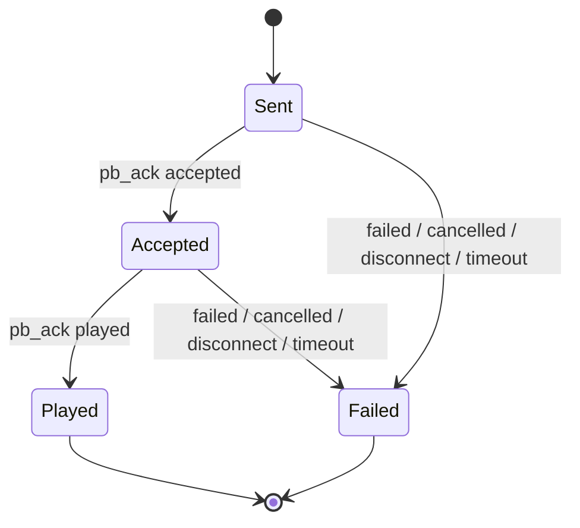

# 舵机控制与动作系统架构

更新日期：2026-08-19
适用分支：`fix/audit-p0-p1`

## 1. 结论

舵机链路已经收敛为“显式动作请求 → 本机动作 catalog → 逻辑坐标规范化 → 单个 PB
事务 → 固件 motor actor → terminal ACK”的闭环。摄像头、人脸结果、VAD、LLM 等待、
LLM 失败等待、随机口播动作和空闲状态都不能再触发转头。

本轮修复后的关键不变量：

1. Web、RTC、LLM 和场景都使用同一份 PC-local `servo.json`。
2. 上层只提交逻辑坐标或语义 preset；reverse 和限位只在服务端执行一次。
3. 多步动作作为一个数组原子提交，不允许只执行前缀。
4. `replace` 会取消正在执行和排队的旧 motor epoch；`append` 只用于同一 `req` 的后续
   chunk，或设备全部 lane 空闲时开启新请求，不能跨活动请求偷偷拼接。
5. 相对位移由 motor actor 在实际执行时基于上一段最终指令位置解析。
6. 每 20 ms 最大改变 3°；时间不够时延长动作，绝不在 deadline 跳到终点。
7. 成功的定义是设备回报 `played`，不是 HTTP 接受、WebSocket 写入或 `accepted`。
8. ACK 中的位置是最终 PWM 指令位置，明确标记 `pose_source=commanded`；设备没有编码器，
   因此它不是机械实测角度。

## 2. 总体链路

```mermaid
flowchart LR
    A["Web / RTC move_head / LLM moves / 场景"] --> B["Motion catalog\n语义 preset"]
    B --> C["逻辑坐标、视角、限位、reverse"]
    C --> D["PB servo[] 原子事务\nreplace / append"]
    D --> E["USB CDC 有序发送"]
    E --> F["固件 PB 校验与共享 timeline"]
    F --> G["motor actor\n20 ms / ≤3°"]
    G --> H["completed / failed / cancelled"]
    H --> I["pb_ack\naccepted / played / failed / cancelled"]
    I --> J["RTC 结果 / HTTP operation / Web 状态"]
```



## 3. 模块边界

| 层 | 模块 | 职责 |
| --- | --- | --- |
| 配置与 catalog | `servo_config_store.py` | 加载/保存限位、reverse、视角和 preset；校验唯一 ID、字段长度、步数、总时长与坐标范围；生成模型可见 catalog |
| LLM 解析 | `llm/utils.py` | 只接受 catalog 中的 `moves[]`；不再接受模型输出的原始 `servo` 坐标 |
| 预设展开 | `pb/llm_plan.py` | 视角转换、preset 查找、按期望时长缩放、逻辑坐标转协议坐标 |
| PB 组帧 | `pb/wire.py`、`pb/servo_pcm.py` | 把动作、表情和音频编译到同一 PB 时间线；不再随机注入动作 |
| 显式动作执行 | `application/interaction_feedback.py` | 构造 servo-only PB；执行 send → accepted → played 闭环 |
| RTC 工具 | `application/rtc_tool_service.py`、`rtc_worker_tools.py` | `move_head` 动态 enum；仅 `played` 后返回成功 |
| HTTP 控制 | `ws/http_api.py` | 旧 query 单步兼容；JSON `steps[]` / `preset` 原子动作；持久 operation 状态 |
| ACK gate | `ws/pb_ack_waiter.py` | 按 `(device_id, req)` 跟踪 accepted/played/failed/cancelled；断线立即唤醒 |
| 场景 | `scene_playbooks_store.py`、`scene_playbook_runner.py` | canonical `chunks[]`；一个 chunk 可含并行 `moves[]` / `anims[]` |
| 固件协议 | `hardware/firmware/asr_chat_client.*` | 完整校验 servo 数组、PB timeline、epoch 取消、terminal ACK |
| 固件执行 | `hardware/firmware/head.*` | 原子入队、相对动作顺序解析、安全斜坡、PWM 指令位置上报 |

## 4. 配置、坐标和动作 catalog

### 4.1 单机数据模型

运行时统一读取 `service/data/local/servo.json`；`data/global/servo.json` 只是首次初始化模板。
更换 USB 设备不会切换动作库。`device_id` 只用于把当次请求路由到当前在线设备。

### 4.2 坐标契约

- `xm=0` / `ym=0`：绝对逻辑角。
- `xm=1` / `ym=1`：相对逻辑位移。
- `xm=2` / `ym=2`：本轴保持（HOLD）。HOLD 是合法的上层输入，Web 页面原样透传，
  不再被静默强转为绝对角（旧 lab 页的 HOLD→ABS 强转可能把头猛甩到限位下限）。
- 硬件包络与出厂默认限位：X `10..170`，Y `70..110`
  （`SERVO_HARDWARE_ENVELOPE` / `DEFAULT_SERVO_LIMITS`）。
- shipped 配置的 X reverse 与 Y reverse 均为 0。
- viewer 视角下，`look_left` / `look_right` 及四个对角 preset 在查找时交换；preset
  内部仍保存机器人本体逻辑坐标。

服务端转换顺序是：

```text
语义 preset / Web logical step
→ viewer/robot 视角解析
→ 逻辑绝对角或相对 delta 校验
→ 配置限位
→ xReverse/yReverse（绝对角镜像、相对量变号）
→ PB 协议 step
```

客户端不得预先 reverse，否则会产生双重反向。

### 4.3 catalog 校验

- preset ID：1–80 个受限字符，大小写不敏感且唯一。
- label 最长 80，description 最长 500。
- 最多 128 个 preset；单 preset 最多 32 步；总时长最多 300000 ms。
- 绝对坐标必须位于本次文档声明的限位内。
- 相对位移不能大于对应轴的完整安全行程。
- 人脸跟随时代的 43 个 `pose_*` 内部关键帧 preset 已从 shipped 配置删除；
  机制上 `pose_` 前缀仍默认 `exposeToModel=false` 以兼容旧本地文档。
- RTC schema 和 LLM prompt 使用同一个模型可见 catalog；模型不能编造动作名。

### 4.4 servo contract 单一来源

`servo_protocol.py` 是三端契约常量的单一来源（`SERVO_HARDWARE_ENVELOPE`、
`SERVO_MAX_SEGMENTS_PER_PB=32`、`SERVO_MAX_BATCH_DURATION_MS=300000`、
`SERVO_MIN_SEGMENT_DURATION_MS=50`）。Core 通过 `GET /api/servo_contract` 暴露
硬件包络、批次限制、viewer 视角交换表和 preset catalog；lab/debug/home 页面统一
拉取该端点，不再各自手抄（获取失败时禁用控件而不是回退旧值）。
`tests/test_servo_contract_lockstep.py` 以正则抽取固件源码，断言固件限位与
`servo_protocol` 常量锁步；3D 预览与真机链路使用同一 axis reverse 规则。

## 5. 四类调用入口

### 5.1 Web

手工单步和 preset 都提交逻辑坐标。多步 preset 使用一次 JSON 请求：

```json
{
  "steps": [
    {"x": 90, "y": 80, "xm": 0, "ym": 0, "ms": 500},
    {"x": 0, "y": 20, "xm": 1, "ym": 1, "ms": 500}
  ],
  "action": "replace",
  "operation_id": "servo:example"
}
```

也可提交 `{ "preset": "nod_head", "duration_ms": 1080 }`。`steps` 与 `preset` 不能混用。
旧 query 单步接口保留兼容，但内部走同一规范化和 terminal ACK 链路。

### 5.2 RTC

`move_head` 的 `move` 参数是由本地 catalog 动态生成的 enum。Core 展开 preset，发送一个
servo-only `pb_single`，先等 `accepted`，再等 `played`。`failed`、`cancelled`、断线和超时
都会作为失败返回给 Agent，不能生成“已经转好了”的假结果。

LiveKit `call_id` 会稳定派生 16 字节 PB request ID；同一工具调用的串行重试落到同一请求，
不会每次重新生成动作。多步 preset 的时长下限为 `step_count × 50 ms`，不能把整套动作压缩
到固件无法合法执行的区间；物理限速预算只用于 terminal `played` 超时，不反向篡改声明时间线。

### 5.3 LLM / 非 RTC 对话

模型只输出：

```json
{"moves":[{"move":"nod_head","ms":1080}]}
```

原始 `servo:[{xm,ym,x,y,ms}]` 已从模型契约和解析器删除。未知 `move` 被拒绝，内部
`pose_*` 不进入 prompt。没有明确语义动作时必须输出 `moves:[]`。

### 5.4 场景编排

canonical 格式只有 `chunks[]`。一个 chunk 中的 `moves[]`、`anims[]` 和 `text` 从同一
时间原点开始，因此舵机轨与表情轨可以并行：

```json
{
  "id": "timeline",
  "text": "",
  "moves": [
    {"move":"look_left","ms":500},
    {"move":"center","ms":500}
  ],
  "anims": [{"anim":"focused","ms":1000}]
}
```

旧 `servo_track/expr_track/text_track` 数据已迁移。保存和运行遇到未知 preset 都 fail-closed，
不再只写 warning 后静默丢动作。

## 6. PB 事务和排队语义

### 6.1 消息形态

servo-only 动作使用 `pb_single`，包含：

- `req`：请求 ID。
- `idx`：分片索引。
- `chunk_ms`：该事务的时间预算。
- `action`：`replace` / `append` / `default`。
- `level`：优先级。
- `servo[]`：完整动作数组。

只有非空 `servo[]`、且没有 audio/anim/assets 的 PB 才属于 servo-only。空 PB 或 anim-only
不能再误走舵机快捷路径。

混合 audio/anim/servo 请求中，完整 `servo[]` 原子批次只放在首个 wire PB；后续音频可按
PCM 容量真实切片，但不会把 ABS/REL 动作近似拆散。单个 wire JSON（含发送时追加字段的余量）
超过 14 KB 会在服务端直接拒绝；普通长 PCM 会切成不超过设备上限的真实连续片段。只有
动作/表情尾巴时使用 JSON-only PB，不再用伪静音 PCM 占用 USB 和音频 lane。

### 6.2 replace / append

- `replace`：递增 motor cancel epoch，取消正在执行的旧 ramp，排空旧队列，再提交新批次。
- 同一 `req` 的后续 `append` chunk：保留当前 epoch，在容量允许时继续该原子请求。
- 不同 `req` 的 `append`：只有 audio/display/motor 全部无 pending 工作时才可开启；只要
  任一 lane 仍在执行或排队就 fail-closed，避免动作/表情尾巴被错误接到别的请求上。
- 需要连续播放多个显式场景的调用方必须把各段重编为同一个 `req`、连续 `idx`、且
  只有最后一帧为 `pb_end`；USB expression runtime 不再硬编码追加 idle，而是在 lease
  结束后以新的独立 replace 恢复当时最新的 RTC 期望状态。
- 新批次先完整校验并检查队列容量；任一步非法或容量不足时整批拒绝。
- 极端情况下若 RTOS 入队不变量被破坏，固件取消 epoch 并排空已可见前缀，仍不允许半套动作继续。
- `replace` 的全量 preflight 在清场、切 epoch 和建立 terminal track 之前完成；畸形新请求只
  回 `failed`，不会取消或扰动正在运行的合法旧请求。
- rejected 多帧链仍按声明长度进入有界 binary discard（最多 9 帧、每帧受 payload 上限约束），
  精确吃掉后续 BIN 后恢复 JSON 边界，不能通过 transport reset 误伤旧请求。

## 7. 固件 motor actor

### 7.1 任务模型

- 单一 `motor_task` 串行拥有两路 Servo PWM。
- 输入队列深度 32；terminal event 队列深度 64。
- 任务固定 20 ms tick，优先级低于音频，避免舵机阻塞 RTC 播放/录音。
- 启动 GPIO 软归中和正式 `Servo.attach` 都使用统一 `1000..2000 μs` 标定范围。

### 7.2 相对动作

PB parser 不提前把相对动作转为绝对角。actor 取出每一段时，才以当前最终指令位置解析：

```text
当前位置 90，队列 +10、+10
→ 第一段目标 100
→ 第一段完成后第二段目标 110
```

因此连续相对动作不会再因为“解析时当前位置相同”而丢失累计位移。

每条服务端动作还携带 `x_min/x_max/y_min/y_max`。固件要求四项全有或全无，先验证硬件
包络；ABS 必须落入软限位，REL 幅度不得超过软行程。actor 执行 REL 时使用 64 位中间值，
基于当时逻辑姿态逐段求和并再次 clamp，避免溢出、配置变更和累计动作越界。

### 7.3 速度和 deadline

PB 动作以共享 timeline 的 `start_at_ms` 为时间原点。理想插值位置只决定当前应追到哪里，
单 tick 实际输出仍限制为最多 3°。如果 USB/任务调度导致动作开始过晚，或请求时长短于
安全完成时间，actor 会继续以安全速度追到目标后再回报完成，绝不会在 deadline 瞬移。

声明时间线和 motor 完成游标彼此独立：下一 audio/anim chunk 仍按声明的 `chunk_ms` 前进，
不会因为上一段舵机需要更久的物理追赶而整体后移；只有最终 `played` 预算取 audio、display、
motor 三条 lane 的最大完成时刻，并对跨 chunk motor batch 做串行累计。

### 7.4 位置真实性

硬件没有角度编码器。`head_read_x/y` 和 ACK 记录的是最近一次发给 PWM 的目标角：

- 可以证明软件最终下达了什么位置；
- 不能证明舵机没有卡住、掉电、齿轮打滑或因供电压降未到位；
- 真正机械闭环需要编码器、电流检测或外部视觉标定，当前不具备。

## 8. ACK、成功和失败

状态机：



- `accepted`：固件接受该 idx 的工作，不代表完成。
- `played`：该请求的 audio/display/motor 预期工作全部完成。
- `failed`：协议、分配、attach、入队或 worker 执行失败。
- `cancelled`：被 replace/reset/断线等显式取消。
- 断开设备时 `cancel_device()` 会立刻唤醒全部等待者。
- terminal 状态不可被迟到的 `accepted/played` 覆盖。
- servo pose 与产生它的 `(epoch, req, idx)` 绑定，不使用跨请求全局目标。
- terminal lease 只能单调延长，不能被后到的较短声明截短，因此物理限速追加出的完成预算
  不会在多 chunk 更新中丢失。
- durable 请求必须先把 terminal 结果写入 NVS；持久化失败强制回 `failed`，绝不先报
  `played` 再丢失可重放结果。

## 9. 已删除的自动动作

以下代码、配置、模型 schema 和页面入口均已删除，而不是仅默认关闭：

- 摄像头/人脸检测结果驱动转头。
- confirmed-speech 拍照后无人脸搜索。
- `look_at_person` 和 `set_camera_follow`。
- 常态人脸跟随。
- LLM 等待点头/摇头。
- LLM 失败期间循环动作。
- TTS 分片随机舵机动作。
- 空闲主动低头、打盹及其偏好字段。
- 固件 CONTROL JSON 的 factory/action 手势命令层（`head_*`、`adjust_*`）及其
  同步等待机制；CONTROL 命令面只剩只读 `head_pos`、`task` 与 `reboot`，开机
  回中改为异步，消除跨 lane 的 cancel-epoch 隐患。

保留的动作来源只有明确 Web 控制、RTC `move_head`、合法 LLM 语义 preset 和场景编排。

## 10. 本轮发现并修复的问题

| 级别 | 问题 | 修复 |
| --- | --- | --- |
| P0 | `replace` 没有清理旧 motor 队列 | epoch 取消 + drain，正在执行和排队动作都终止 |
| P0 | servo 数组逐段入队，可能执行失败批次的前缀 | 完整预校验、容量预检、原子 batch 提交 |
| P0 | 连续相对动作在 parser 阶段提前绝对化 | REL 保留到 actor，按执行顺序解析 |
| P0 | 迟到/短 deadline 可能直接跳终点 | 20 ms 最大 3°；必要时延长完成时间 |
| P0 | anim-only / 空 PB 误判 servo-only | 要求非空 servo 且无其它媒体 |
| P0 | `failed/cancelled` 被当成 accepted | 服务端和固件保留真实 terminal phase |
| P0 | 断线 ACK waiter 不醒 | `cancel_device` 设置 disconnected 并 notify all |
| P0 | RTC 只确认发送 | 必须收到 `played` 才成功 |
| P0 | Web 两套页面 reverse 契约不一致 | 所有页面只发 logical，服务端唯一转换 |
| P0 | Web 多步 preset 只执行第一步/逐步 HTTP | 一次 JSON 原子提交完整数组 |
| P0 | 旧 playbook 将并行轨串行化 | 迁为单 chunk 的并行 `moves[]/anims[]` |
| P0 | 启动/RTC/Web 表情曾由多个来源直接 replace/append，造成 pending 冲突和串脸 | 全部进入 USB 会话级 `RtcExpressionRuntime` 来源 lease；即使 RTC 未连接也不回退直发，显式表情不再硬编码 idle 尾巴，lease 结束恢复最新 RTC 期望状态 |
| P0 | servo-only PB 为满足旧 wire 约束自动生成默认嘴型，纯动作也会偷偷换脸 | 空音频纯舵机 row 不生成 `anim`；只有真实图片才显式创建 display row |
| P0 | RTC 表情在 USB 写入后立即假报 `played` | 在同一 PB chain 锁内执行 begin → send → final accepted → played；失败、取消、断线和超时保留真实状态 |
| P0 | 长 servo 物理追赶错误拖延后续 audio/anim 声明时间线 | 三 lane 同原点运行；motor 独立串行游标仅扩展最终 played 预算 |
| P0 | 畸形 replace 在校验完成前清掉合法旧请求 | destructive mutation 前完成全链 preflight；非法请求零副作用 |
| P0 | rejected 链残留 BIN 导致协议失步或 reset 旧请求 | 独立有界 discard 精确消费被拒链的 binary |
| P0 | durable terminal 写 NVS 失败仍可能回 played | 持久化失败强制 terminal failed |
| P1 | 模型看到 55 个内部关键帧 | catalog 只暴露 12 个语义 preset |
| P1 | 模型可直接输出原始坐标 | 删除模型侧 `servo` 契约 |
| P1 | 六个 shipped Y 坐标越界 | 修正到 70/110，并在保存时严格拒绝越界 |
| P1 | preset 无重复 ID/规模约束 | 增加 ID、长度、步数、总时长和限位校验 |
| P1 | 启动与正式 PWM 标定范围不一致 | 统一 1000..2000 μs |
| P1 | `uint16_t` 截断长动作 | 舵机时长和 motor 命令统一 `uint32_t`，上限 300000 ms |
| P1 | 32 段 `MotorCmd` 临时数组占用任务栈并可能溢出 | 完整 preflight 后改用 PSRAM/heap 暂存；分配失败发生在 enqueue 前且零执行 |
| P1 | soft bounds 只在服务端生效，固件 REL 可累计越界 | 限位随每段指令下发，parser 与 actor 双重校验/clamp |
| P1 | ACK terminal lease 被较短后续 chunk 缩短 | lease 只延长不缩短，保留物理完成预算 |
| P1 | RTC 重试重新生成 request ID、压缩多步动作过度 | call_id 稳定派生 ID；时长下限按步数 × 50 ms |
| P1 | 超大 wire JSON / PCM 仅告警或伪切片 | JSON 超限 fail-closed；长 PCM 真实切片且 JSON-only 尾巴不补静音 |
| P2 | 自动动作虽关闭仍留配置和 UI | 删除随机、等待、主动 idle 代码与设置 |

## 11. 验证矩阵

自动化覆盖：

- catalog 唯一性、限位、模型可见性、LLM/RTC enum 一致性；
- HTTP 单步兼容、多步/preset 原子请求、非法混用和未知 preset；
- ACK accepted/played/failed/cancelled/断线/超时；
- RTC `move_head` 的 terminal played 闭环；
- RTC 表情无 idle 尾巴、terminal ACK、失败/断线/超时、来源 lease 和 chain-lock 计时边界；
- playbook 并行 lane 总时长与未知 preset fail-closed；
- 固件 servo-only 判定、batch 原子性、REL 顺序、replace/cancel、32 位时长、速度上限、
  soft bounds、monotonic lease、durable terminal、preflight 顺序、rejected BIN discard、
  heap batch、commanded pose 和 PWM attach 范围；
- Web 配置字段、Y 限位、逻辑坐标、多步请求与 canonical 场景数据保留。

最终测试数字由本轮收尾的同一代码快照统一统计，记录在交付摘要中，避免文档中的阶段性
计数早于后续协议修复而失真。

## 12. 已知残余和边界

- HTTP `ControlOperation` 目前能保证同一进程内的 operation ID 幂等和 lease 收敛；服务进程
  重启后，数据库中的 `accepted/running` 行没有持久化完整 payload，恢复器不能重建并重放
  原动作，只能在 deadline/lease 到期后收敛为失败。这需要后续新增 durable payload/outbox
  才能成为真正的跨进程 exactly-once 控制。
- 同一个 RTC `call_id` 若被并发重复提交，第二个请求可能得到 `request_active`，尚未复用第一个
  调用的最终结果；串行重试已稳定幂等，并发 single-flight 结果共享仍是 P2。
- boot wake 为避免阻塞设备唯一上行收包循环，只记录 `sent`（完整写入 transport），不伪称
  `played`；RTC 表情和舵机工具则由独立任务完整等待 terminal ACK。
- 设备无舵机编码器，软件 ACK 仍只能证明 commanded pose，不能证明机械实际到位。

## 13. 仍需真机验证

源码和静态契约不能替代以下硬件验收：

1. 逐步执行 center、左右、上下、点头、摇头，确认机械方向和 viewer 语义。
2. 用示波器或逻辑分析仪确认 1000..2000 μs PWM 与 50 Hz 更新。
3. 连续多步和 replace 中断时，测量取消延迟是否在一个 20 ms tick 附近。
4. 同时播放音频和大幅转头，观察 USB 5 V 压降、喇叭断续、舵机抖动和设备复位。
5. 堵转测试只做短时、受控验证，记录峰值电流和温升；当前没有电流闭环保护。
6. 比较 ACK commanded pose 与外部量角/视觉观测，确认机械误差和死区。

本轮按约束只编译、不自动烧录 COM4。真机结果必须在用户确认烧录后单独记录。
